> Originally published on [Medium](https://itsmariodias.medium.com/authentication-in-spring-cloud-azure-81f82bc240a8).


*Photo by [Towfiqu barbhuiya](https://unsplash.com/@towfiqu999999) on [Unsplash](https://unsplash.com/)*

Welcome to the third and final post in the Spring Cloud Azure Event Hubs series! In [part 1](../publish-and-consume-events-with-spring-cloud-stream-and-azure-event-hubs/) and [part 2](../configure-multiple-binders-with-spring-cloud-stream-and-azure-event-hubs/) of this series we discussed how to create a Spring Application to send and receive events to and from an Azure Event Hub service. We also discussed how to configure multiple connections to different Event Hub services in the same application. In this post we will discuss the different ways we can connect to Azure Event Hubs, and the recommended ways to secure your application in production environments. Even though I focus on Event Hubs in this post, the authentication methods are the same for any other Spring Cloud Azure integration, like Service Bus, Blob Storage, etc.

## Setup

Once again I won’t be going over the specifics on how to create the Azure resources we will be needing, as I have already covered that in [part 1](../publish-and-consume-events-with-spring-cloud-stream-and-azure-event-hubs/). Instead we will be using the same configuration we setup in [part 2](../configure-multiple-binders-with-spring-cloud-stream-and-azure-event-hubs/), so we can see how different authentications work at the same time.

So that means our configuration should look like below:

**Azure EventHub Namespaces:** `red-trainer` and `blue-trainer`.

**Azure EventHub Instances:**

- `bulbasaur` in `red-trainer` namespace.
- `charmander` in `red-trainer` namespace.
- `squirtle` in `blue-trainer` namespace.

**Azure Storage Accounts:**

`redbackpack` and `bluebackpack`.

**Containers:**

- `poke-ball` in `redbackpack` storage account.
- `great-ball` in `redbackpack` storage account.
- `ultra-ball` in `bluebackpack` storage account.

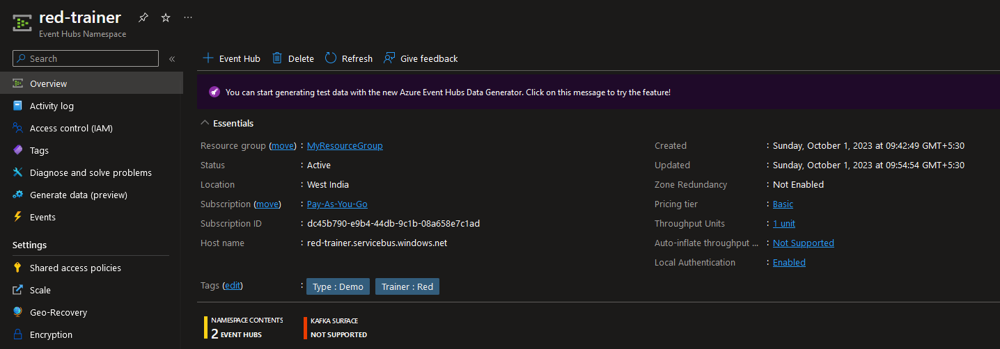
*Event Hubs Namespace overview dashboard.*

## Need for Secure Authentication

In my previous posts, we largely didn’t have to worry about authentication. We just used the **Shared Access Signature** method (via Connection string) since its the easiest way to get an application running. Of course though that way of authentication isn’t secure, since we are supplying the key to our application directly. We can use *Azure Key Vault* to store our keys so they aren’t exposed directly but this requires some effort to configure and maintain and the existence of the key will always pose a security risk. Microsoft instead recommends using managed identities or service principal based authentication as they are more secure and you don’t have to go through the effort of managing your credentials.

To ensure that no one uses connection strings to connect to our resources, we can disable **Local Authentication** for *Event Hubs* and disable **Enable storage key access** for *Storage accounts*.

## Managed Identities

As the name suggests, managed identities eliminate the need for us to manage credentials and lets Azure handle it. Internally it basically provides an identity that the application can use to securely connect to resources via Azure AD. It should be noted that since this identity makes use of Azure AD, we have to specify the roles and accesses that the identity can make use of.

Managed Identities only work and make sense in the context that all the resources are on Azure. So this means that for our application to use managed identities, it needs to be deployed and run in a machine hosted on Azure. There are many ways to deploy a Spring application in Azure, but for this post I will be making use of **Azure Spring Apps**.

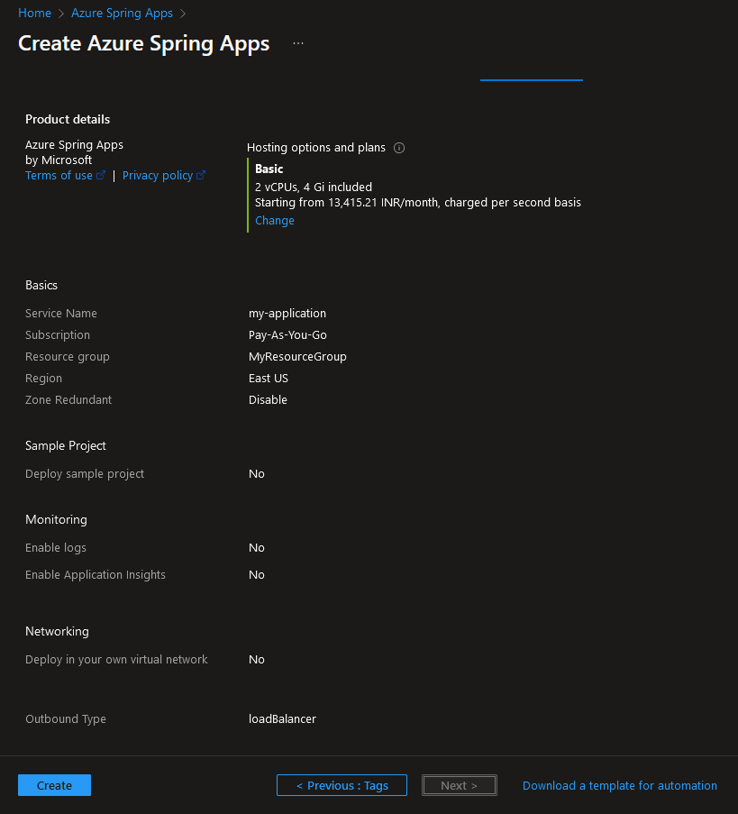
*Creating a simple Azure Spring Apps instance.*

> You also need to create a spring application to actually configure managed identities. If you’re using IntelliJ IDEA, you can [follow this guide](https://learn.microsoft.com/en-us/azure/spring-apps/how-to-intellij-deploy-apps) to quickly and easily deploy your application using Azure Spring Apps. Else, you can give [this quickstart](https://learn.microsoft.com/en-us/azure/spring-apps/quickstart?pivots=sc-enterprise&tabs=Azure-portal%2CIntelliJ%2CConsumption-workload) a try as well.

There are two types of managed identities offered in Azure, and we’ll be exploring both of them in our sample application.

### System-assigned managed identity

These managed identities are directly configured on the Azure service/ resource itself, either during or after its creation. When you enable it, an identity gets registered with Azure AD and is tied to the resource. If the resource is deleted, the managed identity is deleted as well. In case of Azure Spring Apps we can easily enable it by navigating to our Spring application dashboard in our Azure Spring Apps service and selecting *Identity* on the left pane.

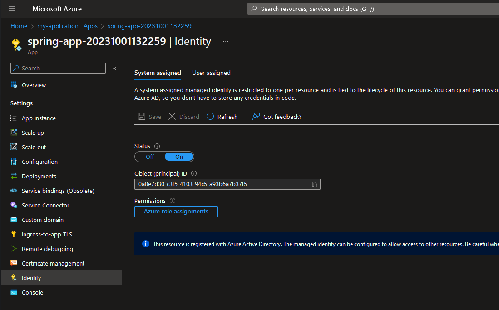
*Enabling system-managed identity for an Azure Spring App.*

All we have to do is enable it is to set **Status** to *On*. Then we need to click the **Azure role assignments** button under *Permissions* to configure the roles for our resource.

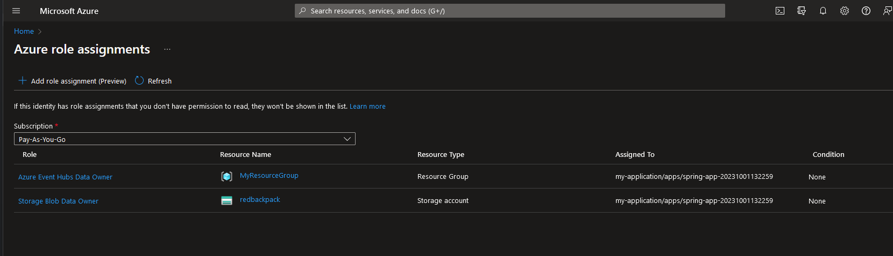
*Role assignments for our system-assigned managed identity.*

In this case I give the system-assigned managed identity access to Event Hubs and Blob Storage for `red-trainer` and `redbackpack` respectively.

On our Spring application in the properties file we just have to add the following property:

```yaml
spring:
  cloud:
    azure:
      credential:
        managed-identity-enabled: true
```

Yup, that’s it. No passwords, secrets or keys needed. Not even any kind of ID since its completely handled by Azure.

### User-assigned managed identity

As the name suggests these identities are defined and assigned by the user to the particular resource. This is useful you want to reuse the same identity across multiple resources. To create your own managed identity, just search for `Managed identities` on the Azure Portal.

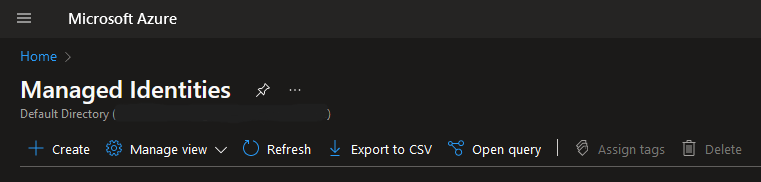
*Managed Identities dashboard.*

Then go ahead and create a new identity. There’s not much to setup here except assigning a **Resource group**, **Region** and **Name**. We name our managed identity `bluetrainercard` to highlight that it belongs to `blue-trainer`.

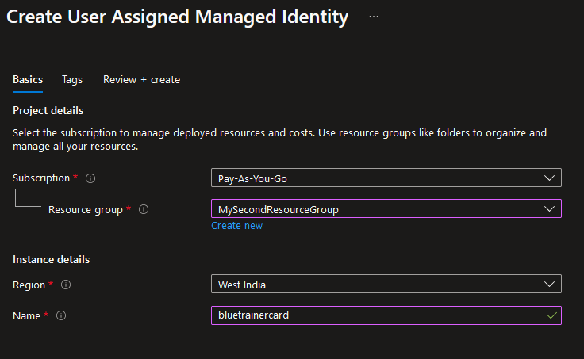
*Creating a user-assigned managed identity.*

Once that’s done, we need to assign some roles to our identity so that it has the permission to use the resources it needs. On the Overview page for the managed identity, navigate to the *Azure role assignments* and click on **+ Add role assignment**.

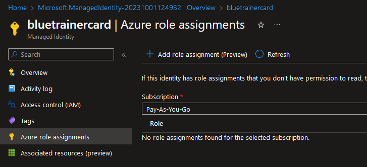
*Azure role assignments screen for Managed Identity.*

Adding a role is simple, just specify the scope of the permission and the specific role. In our case similar to what we did for the System-assigned managed identity, we give `bluetrainercard` the roles **Azure Event Hubs Data Owner** and **Azure Blob Storage Data Owner** for the resources belonging to `blue-trainer`.

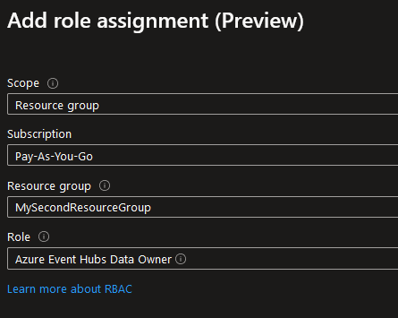
*Adding a new role assignment.*

With that done our user-assigned managed identity is now configured! All that is left is to assign the managed identity to our Spring application, which can be done on the Azure Spring App portal for our application, by going to the *User assigned* tab under *Identity*.

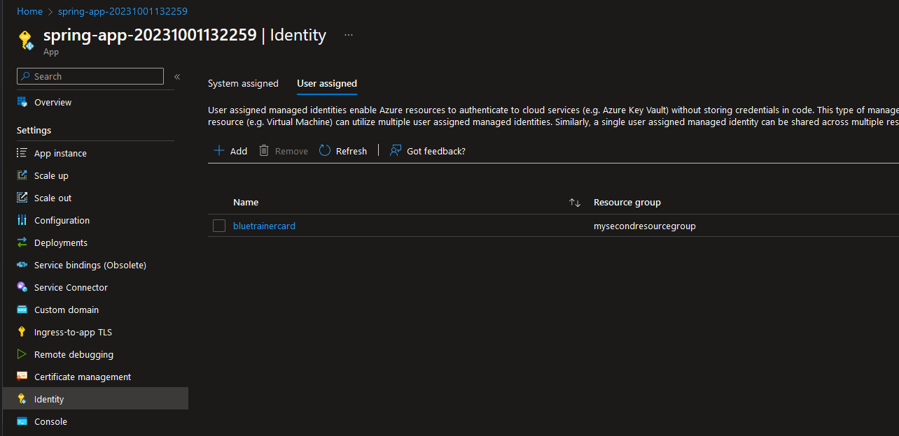
*Adding our user-assigned managed identity to the Spring App instance.*

Then we need to configure our application properties file in our Spring application so that can make use of this identity. Below is the property that needs to be set:

```yaml
spring:
  cloud:
    azure:
      credential:
        managed-identity-enabled: true
        client-id: ${AZURE_MANAGED_IDENTITY_CLIENT_ID}
```

The only difference between system-assigned and user-assigned identities is that for user-assigned identities we need to specify the `client-id` in our application. You can find this on the *Overview* screen of our managed identity.

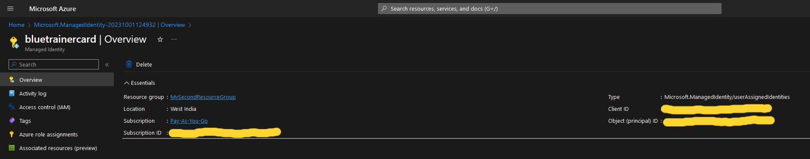
*Managed Identity overview dashboard.*

Now with all this done, you can test both of these configurations on the same application by setting user-assigned identity specifically for the `eventhubs` binder that uses the `blue-trainer` namespace. See the code below for an example:

```yaml
spring:
  cloud:    
    stream:      
      binders:        
        water:
          type: eventhubs
          default-candidate: false
          environment:
            spring:
              cloud:
                azure:
                  credential:
                    managed-identity-enabled: true
                    client-id: ${AZURE_MANAGED_IDENTITY_CLIENT_ID}
                  eventhubs:
                    namespace: blue-trainer
                    processor:
                      checkpoint-store:
                        container-name: ultra-ball
                        account-name: bluebackpack
```

Then all you need to do is deploy your application to Azure Spring Apps. (**Ensure** you provide the correct environment variables as well!). If all is well, you should be able to just trigger the endpoint `POST https://<spring-application-public-endpoint>/publishMessage` (ensure the application has public endpoint **enabled**) and it should give you the same output in the logs as we have seen previously:

```text
[           main] c.sample.eventhubs.EventhubsApplication  : Starting EventhubsApplication using Java 17.0.8 on spring-app-20231001132259-default-25-57596dbcb7-qwjn2 with PID 1 (/tmp/690684e6-33be-4582-9986-8167ec57d61e.jar started by cnb in /home/cnb)
[           main] c.sample.eventhubs.EventhubsApplication  : The following 1 profile is active: "multi-binder-auth"
[           main] c.sample.eventhubs.EventhubsApplication  : Started EventhubsApplication in 9.166 seconds (JVM running for 10.837)
[undedElastic-17] c.s.e.binder.EventPublisherMultiBinder   : Sending grass type : Bulbasaur
[undedElastic-17] c.s.e.binder.EventPublisherMultiBinder   : Sent grass type Bulbasaur.
[tition-pump-0-2] c.s.e.binder.EventConsumerMultiBinder    : Received grass type : Bulbasaur
[tition-pump-0-2] c.s.e.binder.EventPublisherMultiBinder   : Sending fire type : Charmander
[tition-pump-0-2] c.s.e.binder.EventPublisherMultiBinder   : Sent fire type : Charmander.
[tition-pump-1-6] c.s.e.binder.EventConsumerMultiBinder    : Received fire type : Charmander
[tition-pump-1-6] c.s.e.binder.EventPublisherMultiBinder   : Sending water type : Squirtle
[ition-pump-0-15] c.s.e.binder.EventConsumerMultiBinder    : Received water type : Squirtle
[tition-pump-1-6] c.s.e.binder.EventPublisherMultiBinder   : Sent water type : Squirtle.
```

The fact that the above output still prints means that our application is able to connect to both Event Hubs and Storage accounts without using any connection strings. Awesome!

## Service Principal Authentication

Service principals are a concept in regards to Azure AD (currently named Microsoft Entra ID). When we register an application in Azure AD, an **application object** is created. This application object is then used as a template for creating security principal objects. This **security principal** is then used by the entity wishing to access the application. This entity can be a user (**user principal**) or another application (**service principal**).

In fact, Managed Identities are a type of service principal! But since we have already covered that, we’ll instead explore the other type: **Application service principal-based authentication.**

This type of authentication is useful in cases where certain Azure resources do not have the ability to authenticate using Managed Identities.

### Application Registration

A service principal is created automatically after registering an application, so let’s do that first. Navigate to *Azure AD* (aka Microsoft Entra ID) on the Azure Portal. Then go to *App registration* from the left pane.

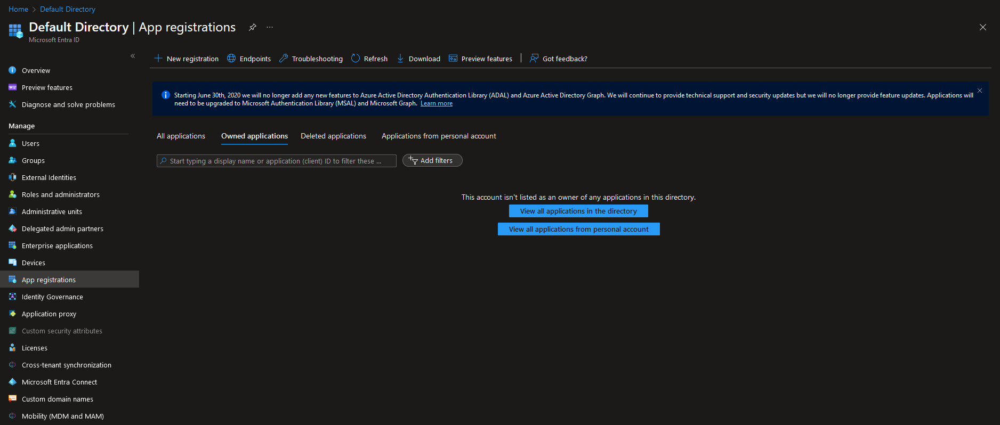
*Azure AD App registration screen.*

Now let’s go ahead an register a new app by clicking the **+ New registration** button. The configuration in our case is pretty simple, just specify a proper name for the application.

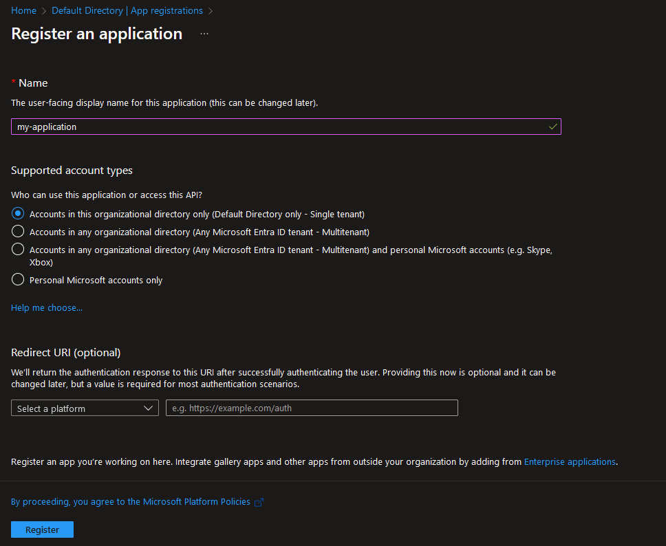
*Registering a new application in Azure AD.*

With that done, we have successfully registered our application to Azure AD. Pretty easy right?

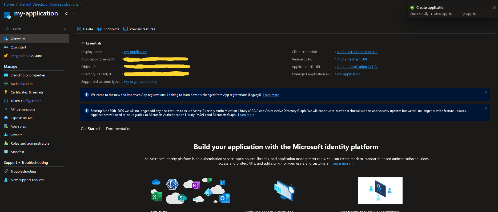
*App registration overview dashboard.*

### Creating a Client Secret

Now unlike Managed Identities, Azure won’t handle authentication here. So we need to configure our own secrets / certificates so that our Spring application can actually authenticate with the resources it wants to use. To do this, navigate to the *Certificates & secrets* from the left menu.

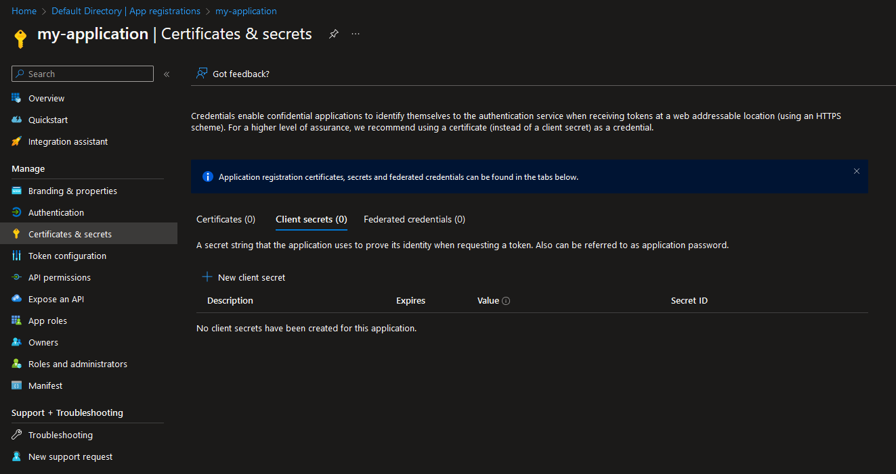
*Certificates & secrets screen for App registrations.*

Authentication with a service principal can be done with either a certificate or a secret. Both involve similar steps, though in case of the certificate it needs to be physically stored in the application’s storage. For now I’ll demonstrate using client secrets. Just navigate to the *Client secrets* tab and select **+ New client secret**.

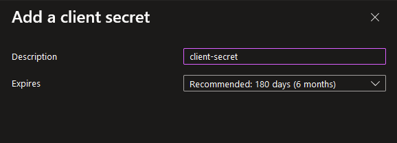
*Adding a new client secret.*

See the *Expires* option. These secrets in fact will expire (the maximum expiry date is around 2 years) and so care must be taken to renew this secret regularly to ensure your applications continue to work properly. With that set we now have our client secret!

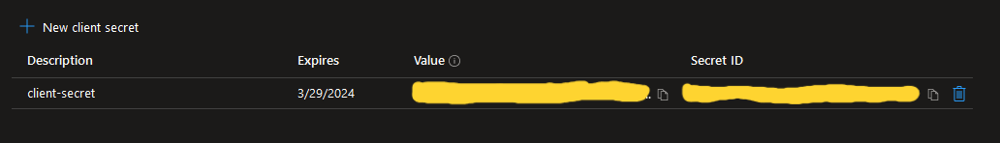
*Client secret description.*

Note the **value** field, we’ll have to use that value as the client secret in our application.

Before we actually add these properties in our application, we first need to assign roles to our service principal for *Event Hubs* and *Blob Storage* access. In this case we’ll assign it on the *Resource Group* level (though you can set it at the individual resource level as well if you want). Navigate to your Resource Group and select *Access control (IAM)* from the left pane.

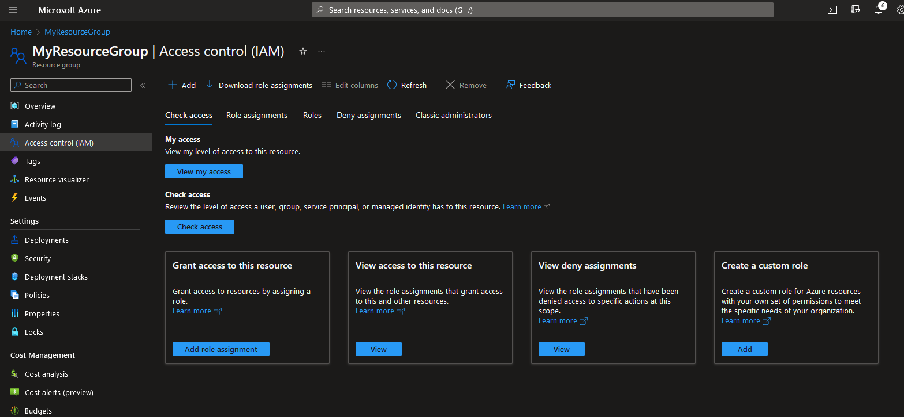
*Access control (IAM) screen for a Resource group.*

From this screen click on the **+ Add** button and then select **Add role assignment** from the drop-down. On the screen that appears, we need to select the role we wish to assign and to who we want to assign it to. Similar to how we configured previously I assign the required accesses and then assign it to our registered application (you might have to search for it in the *Select members* search bar).

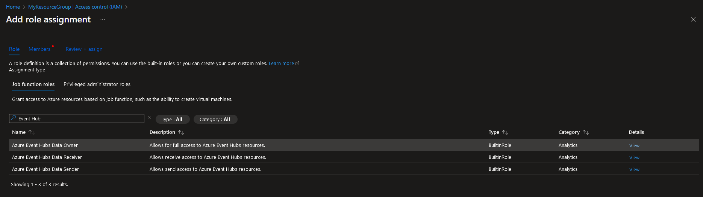
*Adding roles to a new role assignment.*

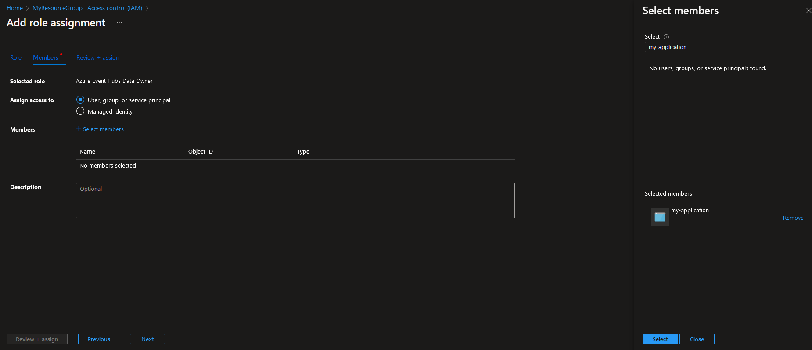
*Adding members to a new role assignment.*

Once you have done the above steps for both Event Hubs and Blob Storage, your role assignments should look like this:

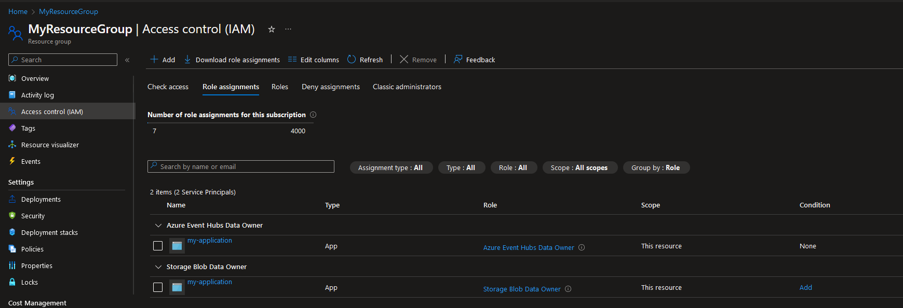
*Role assignments screen for a Resource group.*

Do the same for the other resource group as well. For this demonstration we’ll use the same service principal for both namespaces to reduce the amount of configuration we have to do (though you can always create two if you want, we have already seen that it works with managed identities).

With everything set up finally, we now just have to use the following properties in our Spring application properties file to enable service principal authentication:

```yaml
spring:
  cloud:
    azure:
      credential:
        client-id: ${AZURE_CLIENT_ID}
        client-secret: ${AZURE_CLIENT_SECRET}
        profile:
          tenant-id: ${AZURE_TENANT_ID}
```

You can find both `AZURE_CLIENT_ID` and `AZURE_TENANT_ID` from the overview screen of our application registration. `AZURE_CLIENT_SECRET` is the value I told you to remember previously.

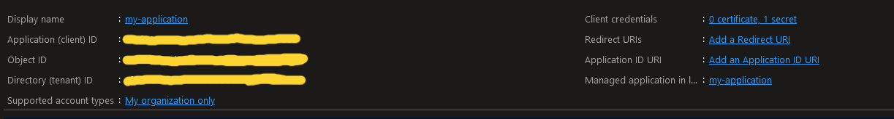
*Client and tenant ID located on the Application registration overview dashboard.*

And that’s pretty much it! You can run your application locally this time since service principals don’t have the same conditions as managed identities, and you should be able to successfully test that the authentication works.

## Conclusion

With this we have now explored all the different authentication mechanisms that Spring Cloud Azure provides. Using either of the two mechanisms discussed will secure your application and protect your Azure resources. I would like to thank you for sticking and following me through this entire Spring Cloud Azure Event Hubs journey, and I hope you’ve learnt just as much as I did. Just remember this is just the tip of the iceberg, and there is a lot to uncover when it comes to Spring Cloud and Azure.

As a parting gift, I have decided to create [a repository](https://github.com/itsmariodias/spring-azure-cloud-stream-binder-eventhubs-sample) that contains **all** the code samples we created as part of this series and made it into a working Spring application that you can run on your desktop. It should give you a head-start should you find it difficult to implement it yourself. With that, thank you once again and I hope to see you in another article some time in the future!

## References

- [Spring Cloud Stream with Azure Event Hubs — Azure Developer Guide](https://learn.microsoft.com/en-us/azure/developer/java/spring-framework/configure-spring-cloud-stream-binder-java-app-azure-event-hub)
- [Spring Cloud Azure authentication — Azure Developer Guide](https://learn.microsoft.com/en-us/azure/developer/java/spring-framework/authentication)
- [What are managed identities for Azure resources? — Azure Developer Guide](https://learn.microsoft.com/en-us/azure/active-directory/managed-identities-azure-resources/overview)
- [Application and service principal objects in Microsoft Entra ID — Azure Developer Guide](https://learn.microsoft.com/en-us/azure/active-directory/develop/app-objects-and-service-principals?tabs=browser)
- [Azure Managed Identity, Service Principal, SAS token and Account Key Usage — Karthikeyan Siva Baskaran](https://medium.com/@kar9475/azure-managed-identity-service-principal-sas-token-and-account-key-usage-aaf19673b8ed)
