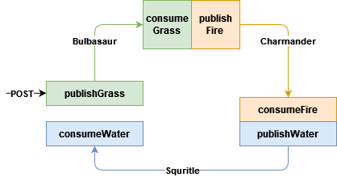

> Originally published on [Medium](https://itsmariodias.medium.com/configure-multiple-binders-with-spring-cloud-stream-and-azure-event-hubs-fd41e19dfe47).

In my last [post](../publish-and-consume-events-with-spring-cloud-stream-and-azure-event-hubs/), we saw how to setup a Event Hub namespace in our Azure Cloud subscription as well as configuring a Spring Boot Application to send and receive events via Event Hubs. In this post we’ll go a step further and understand how to setup multiple binders in our application so it can listen and send to more than one Event Hub.

## Setup


*Photo by [Michael Rivera](https://unsplash.com/@gojomike) on [Unsplash](https://unsplash.com/)*

I won’t go over the exact details as to how to create all the Azure resources we need, I have already covered that [previously](../publish-and-consume-events-with-spring-cloud-stream-and-azure-event-hubs/). Instead I’ll list down the resources we’ll be working with so its easier to understand.

**Azure EventHub Namespaces:** `red-trainer` and `blue-trainer`.

**Azure EventHub Instances:**

- `bulbasaur` in `red-trainer` namespace.
- `charmander` in `red-trainer` namespace.
- `squirtle` in `blue-trainer` namespace.

**Azure Storage Accounts:**

`redbackpack` and `bluebackpack`.

**Containers:**

- `poke-ball` in `redbackpack` storage account.
- `great-ball` in `redbackpack` storage account.
- `ultra-ball` in `bluebackpack` storage account.

Yes, I like Pokemon, how did you know? Jokes aside, we’ll be working with 3 different Event Hubs, and we’ll explore how the configuration changes based on whether the Event Hubs lie in the same namespace or not.

## Configuring the Application Properties

Again, I hope you still have the application we set up from the last post, since we’ll be making our changes on top of that. Below are the properties for our modified application:

```yaml
spring:
  cloud:
    azure:
      eventhubs:
        connection-string: ${AZURE_EVENTHUB_NAMESPACE_CONNECTION_STRING}
        namespace: red-trainer
        processor:
          checkpoint-store:
            container-name: poke-ball
            account-name: redbackpack
            account-key: ${AZURE_STORAGE_ACCOUNT_KEY}
    function:
      definition: consumeGrass;consumeFire;consumeWater
    stream:
      output-bindings: supplyGrass;supplyFire;supplyWater
      bindings:
        consumeGrass-in-0:
          destination: bulbasaur
          group: $Default
        consumeFire-in-0:
          binder: fire
          destination: charmander
          group: $Default
        consumeWater-in-0:
          binder: water
          destination: squirtle
          group: $Default
        supplyGrass-out-0:
          destination: bulbasaur
        supplyFire-out-0:
          destination: charmander
        supplyWater-out-0:
          binder: water
          destination: squirtle
      binders:
        fire:
          type: eventhubs
          default-candidate: false
          environment:
            spring:
              cloud:
                azure:
                  eventhubs:
                    processor:
                      checkpoint-store:
                        container-name: great-ball
        water:
          type: eventhubs
          default-candidate: false
          environment:
            spring:
              cloud:
                azure:
                  eventhubs:
                    connection-string: ${AZURE_EVENTHUB_NAMESPACE_02_CONNECTION_STRING}
                    namespace: blue-trainer
                    processor:
                      checkpoint-store:
                        container-name: ultra-ball
                        account-name: bluebackpack
                        account-key: ${AZURE_STORAGE_02_ACCOUNT_KEY}
      eventhubs:
        bindings:
          consumeGrass-in-0:
            consumer:
              checkpoint:
                mode: RECORD
          consumeFire-in-0:
            consumer:
              checkpoint:
                mode: RECORD
          consumeWater-in-0:
            consumer:
              checkpoint:
                mode: RECORD
          supplyGrass-out-0:
            producer:
              sync: true
          supplyFire-out-0:
            producer:
              sync: true
          supplyWater-out-0:
            producer:
              sync: true
      default:
        producer:
          errorChannelEnabled: true
```

Pretty long, but if you look closely its mostly similar to what we have for the single binder approach, just replicated 3 times since we now have 3 consumers and publishers. The key thing that has to be added in multi-binder approach is the `spring.cloud.stream.binders` configuration. Previously we didn’t need to do this since we could refer to the default binder, which Azure’s Stream Binder library defines at the `spring.cloud.azure` level. So for bindings that you don’t want to use the default binder for, you have to add the property `binder` with the name of the defined binder (see below).

```yaml
consumeFire-in-0:
  binder: fire
  destination: charmander
  group: $Default
```

> To ensure that Spring Cloud Stream uses the properties defined at the `spring.cloud.azure` level for default binders, we need to set `default-candidate` to `false` for every explicitly defined binder.

We don’t have to do anything new for Event Hub `bulbasaur` since its configurations are set in the default binder.

In case of `charmander`, since it is located in the same namespace and account as the default binder, we don’t need to mention those properties again, except for `container-name` since we want the checkpoints to be stored separately in `great-ball`.

For `squirtle`, we have to add a few more properties, since not only is the container different but the namespace and storage account are as well. So we have to define those credentials. (Remember to set the correct keys for the different namespaces and storage accounts, again how to get these keys has already been explained in the previous post.)

## Implementing the Consumer and Producer


*Event flow.*

The diagram above shows the simple flow we’ll be implementing. We initially publish a event containing the message ‘Bulbasaur’ via `POST` call that is then consumed by the `consumeGrass` method listening to `bulbasaur`, which then publishes the message ‘Charmander’ to `charmander` and so on. The event flow would end when message ‘Squirtle’ is consumed by the method `consumeWater`.

There’s nothing fancy going on here, so just refer to the code as given below.

### Consumer:

```java
@Slf4j
@RequiredArgsConstructor
@Configuration
public class EventConsumer {

    private final EventPublisher eventPublisher;

    @Bean
    public Consumer<String> consumeGrass() {
        return pokemon -> {
            log.info("Received grass type : {}", pokemon);
            eventPublisher.publishEventFire("Charmander");
        };
    }

    @Bean
    public Consumer<String> consumeFire() {
        return pokemon -> {
            log.info("Received fire type : {}", pokemon);
            eventPublisher.publishEventWater("Squirtle");
        };
    }

    @Bean
    public Consumer<String> consumeWater() {
        return pokemon -> {
            log.info("Received water type : {}", pokemon);
        };
    }

    @ServiceActivator(inputChannel = "bulbasaur.$Default.errors")
    public void consumerError(Message<?> message) {
        log.error("Handling consumer ERROR: " + message);
    }

    @ServiceActivator(inputChannel = "charmander.$Default.errors")
    public void consumer2Error(Message<?> message) {
        log.error("Handling consumer ERROR: " + message);
    }

    @ServiceActivator(inputChannel = "squirtle.$Default.errors")
    public void consumer3Error(Message<?> message) {
        log.error("Handling consumer ERROR: " + message);
    }
}
```

### Publisher:

```java
@Slf4j
@RequiredArgsConstructor
@Component
public class EventPublisher {

    private final StreamBridge streamBridge;

    public void publishEventGrass(String pokemon) {
        log.info("Sending grass type : {}", pokemon);
        streamBridge.send("supplyGrass-out-0", pokemon);
        log.info("Sent grass type {}.", pokemon);
    }

    public void publishEventFire(String pokemon) {
        log.info("Sending fire type : {}", pokemon);
        streamBridge.send("supplyFire-out-0", pokemon);
        log.info("Sent fire type : {}.", pokemon);
    }

    public void publishEventWater(String pokemon) {
        log.info("Sending water type : {}", pokemon);
        streamBridge.send("supplyWater-out-0", pokemon);
        log.info("Sent water type : {}.", pokemon);
    }

    @ServiceActivator(inputChannel = "bulbasaur.errors")
    public void producerError(Message<?> message) {
        log.error("Handling Producer ERROR: " + message);
    }

    @ServiceActivator(inputChannel = "charmander.errors")
    public void producer2Error(Message<?> message) {
        log.error("Handling Producer ERROR: " + message);
    }

    @ServiceActivator(inputChannel = "squirtle.errors")
    public void producer3Error(Message<?> message) {
        log.error("Handling Producer ERROR: " + message);
    }
}
```

## Testing our Application

Once all is done we can run our Spring Boot Application and then once it ready we can trigger `POST http://localhost:8080/publishMessage` via Postman or a browser. The message sent would contain the string ‘Bulbasaur’. Let’s see what we get in the terminal:

```text
[undedElastic-13] c.s.eventhubs.binder.EventPublisher      : Sending grass type : Bulbasaur
[undedElastic-13] c.s.eventhubs.binder.EventPublisher      : Sent grass type : Bulbasaur
[ition-pump-1-10] c.sample.eventhubs.binder.EventConsumer  : Received grass type : Bulbasaur
[ition-pump-1-10] c.s.eventhubs.binder.EventPublisher      : Sending fire type : Charmander
[ition-pump-1-10] c.s.eventhubs.binder.EventPublisher      : Sent fire type : Charmander
[tition-pump-0-2] c.sample.eventhubs.binder.EventConsumer  : Received fire type : Charmander
[tition-pump-0-2] c.s.eventhubs.binder.EventPublisher      : Sending water type : Squirtle
[tition-pump-0-2] c.s.eventhubs.binder.EventPublisher      : Sent water type : Squirtle
[tition-pump-0-4] c.sample.eventhubs.binder.EventConsumer  : Received water type : Squirtle
```

Hooray! No errors and the logs show that the events are actually being sent via the different binders. With this knowledge in hand you can now develop even more complex applications that may require sending and consuming events to and from various sources, like an orchestration tool. In the next and final post in this series, we’ll explore the different authentication mechanisms that Azure supports, since its not really recommended to use connection string in production environments.

## References

- [Spring Cloud Azure support for Spring Cloud Stream — Azure Developer Guide](https://learn.microsoft.com/en-us/azure/developer/java/spring-framework/spring-cloud-stream-support?tabs=SpringCloudAzure5x#multiple-binder-support)
- [Features and terminology in Azure Event Hubs — Azure Developer Guide](https://learn.microsoft.com/en-us/azure/event-hubs/event-hubs-features)
- [Spring Cloud Stream Documentation](https://docs.spring.io/spring-cloud-stream/docs/current/reference/html/)
- [Spring Cloud Stream using multiple Azure Event Hub — Rafael Faita](https://medium.com/javarevisited/spring-cloud-stream-using-multiples-azure-event-hub-22528df9dac9)
