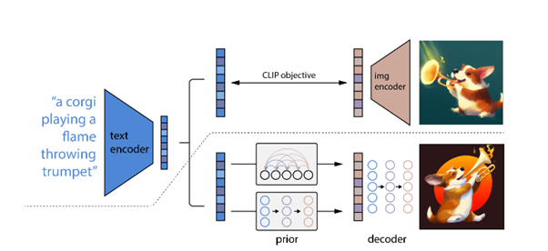
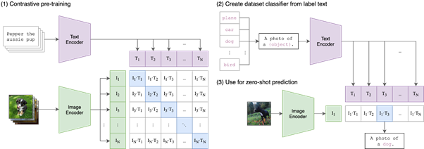
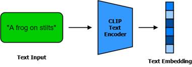
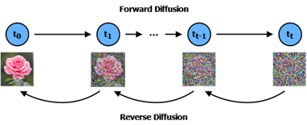
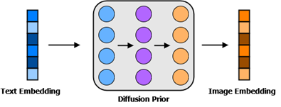
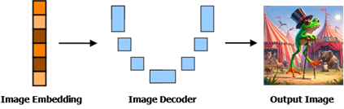
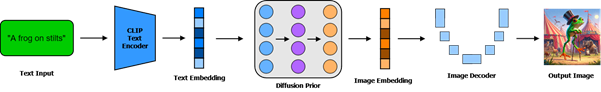

> Originally published on [Medium](https://itsmariodias.medium.com/from-text-to-image-how-do-image-generators-like-dall-e-2-work-17703661944c).

*Photo by [Swello](https://unsplash.com/@getswello) on [Unsplash](https://unsplash.com/)*

## Introduction

Before ChatGPT was released, OpenAI surprised the world with another innovative model called DALL-E. This model had the ability to generate images based on text. The world was changed forever because of this model and its ability to enable everyone to make their own art. Let’s dive into how these models works. Due to the complexity of these models, it is not possible for me to cover their exact technical details, for that I highly recommend reading the technical papers on [Stable Diffusion](https://arxiv.org/abs/2112.10752) and [DALL-E 2](https://openai.com/index/dall-e-2/). Note that we will be looking at **DALL-E 2** and not the original DALL-E, as the newer model uses a different architecture which is more reliable and popular.

## DALL-E Architecture

*Overview of unCLIP, the architecture behind DALL-E 2. Above the dotted line is the CLIP process, below is the image generation process. [Source](https://cdn.openai.com/papers/dall-e-2.pdf)*

First, lets see a high-level overview DALL-E 2 to understand how it goes from reading our text to generating an image.

The steps are as follows:

1. First, the input prompt is encoded into an embedding using a model called **CLIP**.
2. Next, we supply the text embedding to a model called a **diffusion prior** to produce an image embedding.
3. Finally using both the text and image embeddings we generate our final image using a **diffusion decoder model**.

Confused? Don’t worry, I’ll break down each step to understand what is actually happening, and why.

## Step 1: CLIP

Before we can go about generating an image, we need the model to understand our prompt and associate each word with different aspects in our image. Generative models in the past like GANs could easily generate realistic images, but in case of DALL-E we want the model to generate based on our input text. To do this the model needs to be able to associate images with words, i.e. it needs to be able to link textual and visual semantics together.

This is where the [CLIP model](https://openai.com/index/clip/) comes in. CLIP, or **Contrastive Language-Image Pre-training**, is another model developed by OpenAI that is trained to determine how related a given caption is to any image. By training on this particular task, the CLIP model gains a deep level of understanding between the semantics and relations between images and captions, which is very important for DALL-E to be able to generate images related to our input text.

*How CLIP is trained and evaluated. During inference CLIP is able to identify the most appropriate caption for the given image. [Source](https://github.com/openai/CLIP)*

Once the CLIP model is trained, it is frozen (meaning we do not train it any further) and we extract the text embeddings for our prompt using CLIP’s text encoder to be supplied to the diffusion prior.

*The text input is encoded by CLIP to give us the text embedding. (Image by Author)*

## Step 2: Diffusion Prior

Before we understand about the prior, it is important to know the basics of how **diffusion models** work. Diffusion models are generative models that have the ability to generate images from noise. To do this the models are trained to add small amounts of noise to an input image over various iterations, and then attempt to denoise the images to try and get the original image back. There is a lot of technical details I am avoiding to mention here, but if you’re interested I highly recommend checking [this paper](https://arxiv.org/abs/2006.11239) out.

*Diffusion process. First, we add small amounts of noise in steps. Then the model learns to denoise the small amounts of noise between different steps. (Image by Author)*

The diffusion prior is a decoder only based transformer model whose job is to take our input text embeddings and find its associated CLIP image embeddings. To be able to do this the prior model is trained in a manner similar to that of diffusion models. The inputs during training are:

1. The tokenized text/caption.
2. The text embeddings of the caption extracted using the CLIP text encoder.
3. The diffusion timestep (used to determine how much noise was added/ is needed to be removed)
4. The image embedding of the associated image extracted using the CLIP image encoder, but with noise added to it.

Based on these inputs the prior is trained to output the denoised image embeddings.

*The text embedding and captions are used by the diffusion prior to generate the image embeddings. (Image by Author)*

It is to be noted that the developers of DALL-E 2 suggest that the prior was actually not needed as we could have generated the image instead of the image embedding (this is what the GLIDE model is based on, more on that later). But based on thorough analysis it was determined that the images produced with the help of the prior were better and also more diverse.

## Step 3: Image Decoder

Now in order to actually generate the image, we make use of a proper diffusion model. However, for our case because we want to ensure our images are generated based on our prompt, we need to be able the guide the image generation process with textual information. For this a model called **GLIDE** is used, which was introduced in the paper [GLIDE: Towards Photorealistic Image Generation and Editing with text-Guided Diffusion Models](https://arxiv.org/abs/2112.10741). This model supplied text embeddings obtained from CLIP in the diffusion process. The authors of the paper note that this model performed better than the original DALL-E model.

For DALL-E 2, OpenAI modified the GLIDE model to instead use image embeddings from CLIP to generate images using the reverse-diffusion process. Because of the nature of the decoder process, the model is able to generate multiple variations based on the same input image embedding, which is why you get multiple different images when you supply a single prompt.

*The CLIP image embeddings are fed to a UNet style diffusion model, to iteratively denoise a random noised image conditioned at every step by the image embedding to get the final output image. (Image by Author)*

## Summing it all up

In a nutshell, the input text is encoded into a text embedding using CLIP, which is then used by the diffusion prior to get the associated image CLIP embedding, which is used by the image decoder to generate the images. Sounds so simple!

*The entire process used by DALL-E 2 to generate an image from text. (Image by Author)*

## Well Known Diffusion models

While we focussed on DALL-E 2, it should be noted that there are now numerous other text-to-image generative models out there, some popular ones are listed below:

- [**DALL-E 3**](https://openai.com/index/dall-e-3/): The successor to DALL-E 2, it was released by OpenAI in 2023 and is based on the same architecture but with a focus on improving caption fidelity and image quality.
- [**Stable Diffusion**](https://github.com/CompVis/stable-diffusion): An open source model developed in 2022 and provided by Stability AI.
- [**Imagen**](https://deepmind.google/technologies/imagen-3/): Google’s own text-to-image generator, with Imagen 3 being their current latest offering.
- [**Midjourney**](https://www.midjourney.com/home): An AI service that can generate images based on text, available on their website or via Discord.

## Conclusion

I hope from this you have come out learning how exactly DALL-E 2 and similar models generate images from seemingly out of thin air. There is a lot of amazing work and innovation that went through behind the scenes to get these models to the stage where they are. And they will only continue to get better, as we can see with models like [OpenAI’s SORA](https://openai.com/index/sora/) that are now capable of even generating video from text! AI is rapidly evolving, and its important that we keep update to date on these new innovations.

## References

- [How DALL-E 2 Actually Works](https://www.assemblyai.com/blog/how-dall-e-2-actually-works/)
- [GLIDE: Towards Photorealistic Image Generation and Editing with Text-Guided Diffusion Models](https://arxiv.org/abs/2112.10741)
- [DALLE 2 Architecture](https://www.geeksforgeeks.org/dalle-2-architecture/)
- [How Does DALL·E 2 Work? — Aditya Singh](https://medium.com/augmented-startups/how-does-dall-e-2-work-e6d492a2667f)
- [Introduction to Diffusion Models for Machine Learning](https://www.assemblyai.com/blog/diffusion-models-for-machine-learning-introduction/)
