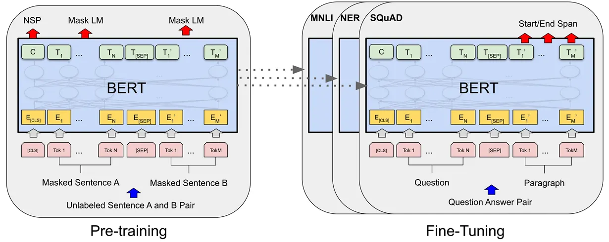
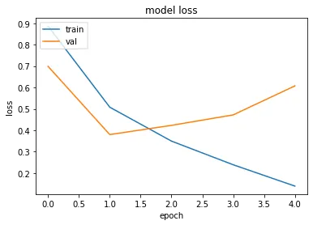
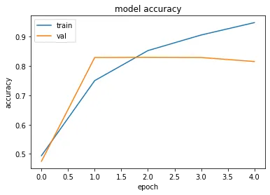

> Originally published on [Medium](https://medium.com/@itsmariodias/leveraging-pre-trained-transformers-for-downstream-tasks-4e234656ca96).


*Photo by [Jéan Béller](https://unsplash.com/@chinatravelchannel) on [Unsplash](https://unsplash.com/)*

Following up on my [last post](./understanding-transformers-for-students) where I explained how the Transformer model works, this post will showcase how you can leverage the power of Transformer models in your own projects and tasks without having to go through the effort of training a large model from scratch. In this case, we’ll be using BERT for performing sentiment analysis on Twitter tweets.

## What is BERT?


*You don’t know me?! ([Source](https://media.giphy.com/media/YFECkRhocFdVkDJLW3/giphy.gif))*

Bidirectional Encoder Representations from Transformers, or BERT is a transformer model introduced by Jacob Devlin, Ming-Wei Chang, Kenton Lee and Kristina Toutanova in their paper [BERT: Pre-training of Deep Bidirectional Transformers for Language Understanding](https://arxiv.org/abs/1810.04805). This model is a variation of the Transformer model which uses only the encoder from the original model. This way the model can be used to provide contextual representations of input sentences.


*BERT’s model architecture ([Source](https://arxiv.org/abs/1810.04805))*

BERT is considered a pre-trained model because the authors trained the model on a large corpus of English data in a self-supervised fashion. This means it wasn’t trained with any particular use case in mind, which gave the advantage of being able to feed lots of public data to the model (This is pretty much what all current Transformer-based models do, like ChatGPT for example). However, we still need an objective while training, else the model won’t actually learn anything useful. For BERT, the authors trained the model on 2 objectives:

1. **Masked language modeling (MLM)**: In this task, around 15% of the input sentence is masked (with a `[MASK]` token) and the model is trained to correctly predict what the masked tokens are. This task trains the model to utilize the entire sentence to get the context to understand what the masked token should be. This is where the bidirectional nature of the model comes from.

2. **Next sentence prediction (NSP)**: In this task, we provide the model with 2 concatenated sentences as input (separating the sentences with a `[SEP]` token). These 2 sentences may represent sentences that follow each other in a paragraph or not. The model is tasked with predicting whether the next sentence follows the previous one or not. This allows the model to understand the relationship between two sentences, which can be useful for downstream tasks like Question Answering.

Once the model is trained on the above 2 tasks and achieves optimal performance, it can then be used in downstream tasks by fine-tuning the pre-trained model.

## Sentiment Analysis:


*Photo by [Denis Cherkashin](https://unsplash.com/@denic) on [Unsplash](https://unsplash.com/)*

So for this article, we will be using a pre-trained model of BERT to perform sentiment analysis on Twitter tweets. Sentiment analysis essentially means to gather the sentiments on a particular topic by observing related tweets on the same. For example, if I say *“The weather is good today”* we can say that the sentiment of the sentence is positive. This task can be useful if we wish to understand public reception to a particular event or situation. For example, if Apple wants to see how people are reacting to their newly launched Apple Vision Pro, they can extract the sentiments from tweets about the product on Twitter.

## Time to Code!


*Photo by [Chris Ried](https://unsplash.com/@cdr6934) on [Unsplash](https://unsplash.com/)*

Now let’s get on with actually implementing our model. We’ll be using Python and TensorFlow for training the model. We’ll also be leveraging the [HuggingFace Transformers library](https://huggingface.co/docs/transformers/index) to provide us with the necessary tools to load and train the BERT model. Because these models are large and not everyone has a GPU or a decent PC to train them, we will be running our code on [Google Colab](https://colab.research.google.com/), an online platform for executing and running Python-based code with free to use GPUs.

### Loading the Libraries

By default Google Colab does not have the transformers library from HuggingFace installed, so run the command below first to install it via `pip`.

```bash
# Install libraries
!pip install transformers
```

Once that is installed, add a new code block and paste and run the below code.

```python
# Load libraries
import os
import tensorflow as tf
import transformers
from sklearn.model_selection import train_test_split
import pandas as pd
import numpy as np
import math
from matplotlib import pyplot as plt
```

The above libraries imported are some of the most widely used libraries for data science and machine learning projects.

## Loading the Dataset

### Dataset Used:

For training our model, we’ll be using the [Sentiment140 dataset from Kaggle](https://www.kaggle.com/datasets/kazanova/sentiment140). This dataset has around **1.6 million tweets** annotated with labels stating if they were positive or negative.

Download the `csv` file and store it in a folder on your Google Drive. We can the mount your Drive on Colab by running the below script:

```python
# Mount the drive
from google.colab import drive
drive.mount('/content/drive')
```

It’ll open a popup asking you to allow access to your drive’s contents, say yes and it’ll successfully mount the drive to the path `/content/drive`.

Let’s define a few variables so we can reuse them everywhere:

```python
INPUT_DIR = "/content/drive/MyDrive/Transformer Demo"
OUTPUT_DIR = "/content/drive/MyDrive/Transformer Demo"
CSV_FILE_PATH = os.path.join(INPUT_DIR, "training.1600000.processed.noemoticon.csv")
LOG_FILE_PATH = os.path.join(INPUT_DIR, "training_log.csv")
CHECKPOINT_FILE_PATH = os.path.join(OUTPUT_DIR, "demo_model_epoch_{epoch:02d}.h5")
```

All our outputs during training will end up being saved in our Google Drive, so that we don’t have to worry about losing our work after we shut down the Colab notebook.

Now lets load our data, we’ll use the `pandas` library to load our `csv` file.

```python
data = pd.read_csv(CSV_FILE_PATH, encoding='latin-1', header=None, 
                   names=["target", "ids", "date", "flag", "user", "text"], 
                   index_col = False)
```

Now our data is loaded and saved in the `data` variable. We can check the contents by calling `data.head()`.

```text
  target  ids  date  flag  user  text
0  0  1467810369  Mon Apr 06 22:19:45 PDT 2009  NO_QUERY  _TheSpecialOne_ @switchfoot http://twitpic.com/2y1zl - Awww, t...
1  0  1467810672  Mon Apr 06 22:19:49 PDT 2009  NO_QUERY  scotthamilton  is upset that he can't update his Facebook by ...
2  0  1467810917  Mon Apr 06 22:19:53 PDT 2009  NO_QUERY  mattycus  @Kenichan I dived many times for the ball. Man...
3  0  1467811184  Mon Apr 06 22:19:57 PDT 2009  NO_QUERY  ElleCTF  my whole body feels itchy and like its on fire
4  0  1467811193  Mon Apr 06 22:19:57 PDT 2009  NO_QUERY  Karoli  @nationwideclass no, it's not behaving at all....
```

We are only really concerned with 2 columns, `target` and `text`. Also to note for this dataset, the data contains some tweets indicating neutral sentiment (`target = 2`) which we will remove. Negative tweets `target = 4` are also converted to `target = 1` since we only have 2 labels to classify against.

```python
data = data[data.target != 2]
X = data["text"]
Y = data["target"].replace({4:1})
```

For training, we will split the above dataset into an 80\:10\:10 split representing the training, validation and testing data.

```python
# We create a 80:10:10 split for train, val and test
X_train, X_test, Y_train, Y_test = train_test_split(X, Y, test_size=0.20, 
                                                    shuffle=True, 
                                                    random_state=42)
X_test, X_val, Y_test, Y_val = train_test_split(X_test, Y_test, test_size=0.50, 
                                                shuffle=True, 
                                                random_state=42)

print("Train size: ", len(X_train))
print("Validation size: ", len(X_val))
print("Test size: ", len(X_test))
```

The sizes of our different splits are:

```text
Train size:  1280000
Validation size:  160000
Test size:  160000
```

`X` contains the input we wish to train on, in this case the text/tweets. `Y` contains the output we wish to obtain aka the sentiment.

### Tokenization

We can’t just feed our text data directly to the model, we need to tokenize it so that each token/word is represented by an index. However in this case because we are using a pre-trained model, we will need to tokenize our data in accordance to the tokenization used by the model. Luckily for us, HuggingFace has a class `BertTokenizer` that can easily tokenize our text to the required format.

```python
# Load the tokenizer used by BERT
tokenizer = transformers.BertTokenizer.from_pretrained("bert-base-uncased")
```

We can specify some properties during tokenization. In our case we’ll limit the maximum length of any sentence to 64 tokens and for any sentence smaller than that we’ll add a padding of 0’s to the end (needed if you want to represent the input data as a well-defined array).

```python
X_train = tokenizer(
            text=X_train.tolist(), 
            padding='max_length', 
            max_length=64, 
            return_tensors='np', 
            truncation=True, 
            return_token_type_ids=False, 
            return_attention_mask=True
        )
```

> *Tokenization will take a while, better take grab a cup of tea in the meantime.*

The above code can be used for similarly for `X_val` and `X_test`. You’ll observe the output contains 2 things, `input_ids` and `attention_mask`. `input_ids` contains our padded sentence converted into indexes, while `attention_mask` contains only 1’s and 0’s, with 1’s representing the non-padded tokens. This is helpful to prevent the model from attending to padded tokens which have no information.

```python
# A sample of the tokenized input
X_train['input_ids'][0], X_train['attention_mask'][0]
```

```text
(array([  101,  1030,  1046, 19279,  4710, 10626,  2007,  8038,  1012,
         1004, 22035,  2102,  1025,  1045,  1005,  1040,  2066,  1037,
         5340,  3653,  1010,  3543,  9221,  3715,  2099,  1012,  3201,
        19779,  1029,  2748,  1010,  2008,  4165,  2204,  1012,  2021,
         2003,  2026,  5404,  3201,  2085,  1029,  1005,  1001,  3653,
        17298, 12680,   102,     0,     0,     0,     0,     0,     0,
            0,     0,     0,     0,     0,     0,     0,     0,     0,
            0]),
 array([1, 1, 1, 1, 1, 1, 1, 1, 1, 1, 1, 1, 1, 1, 1, 1, 1, 1, 1, 1, 1, 1,
        1, 1, 1, 1, 1, 1, 1, 1, 1, 1, 1, 1, 1, 1, 1, 1, 1, 1, 1, 1, 1, 1,
        1, 1, 1, 1, 0, 0, 0, 0, 0, 0, 0, 0, 0, 0, 0, 0, 0, 0, 0, 0]))
```

### Data Generator

Now in our case our input data is ~200 MB, which can easily be loaded into memory. But for situations where your data exceeds 10 GB, it will prove difficult to load all that data into memory. In such situations, using a data generator may prove useful. A data generator allows you to only load in data when required by the model during training. We will be inheriting Tensorflow Keras’ `Sequence` class to create our own generator.

```python
class DataGenerator(tf.keras.utils.Sequence):

    def __init__(self, text, target, batch_size, shuffle=False, step_size=None):
      self.text = text
      self.target = target
      self.batch_size = batch_size
      self.shuffle = shuffle
      self.step_size = step_size  
      self.indices = np.arange(len(self.text['input_ids']))

    def __len__(self):
        if self.step_size:
            return self.step_size
        return math.ceil(len(self.text['input_ids']) / self.batch_size)

    def __getitem__(self, idx):
        inds = self.indices[idx * self.batch_size:(idx + 1) * self.batch_size]
        
        text_ids = self.text['input_ids'][inds]
        text_masks = self.text['attention_mask'][inds]

        target = self.target[inds]
        
        return [text_ids, text_masks], target
    
    def on_epoch_end(self):
        if self.shuffle:
            np.random.shuffle(self.indices)
```

The `__getitem__` method is called by the model during training. `idx` is the step number which can be used to provide different batches at each step during training (The number of steps is `(total number of input data) / (batch size)`). `on_epoch_end` is called at the end of an epoch (when all input data has been processed once) where we shuffle the data so that the batches formed in the next epoch don’t contain the same collection of data (prevents model from relying on the order of data for prediction).

> *Most of these features are provided as arguments in `model.fit()`. However I included this here so you can understand how to implement these features for more complex data loading scenarios (Like with multiple input sources).*

Now to define the data generator for each of our data splits we can call `DataGenerator` like below:

```python
train_gen = DataGenerator(X_train, Y_train, batch_size=64, 
                          shuffle=True, step_size=None)
```

## Building the Model

Now its time to assemble our model. We’ll design our model to directly feed the input to the loaded pre-trained BERT model, whose output we’ll take and apply a simple classification head to output a value between 0 and 1. We’ll define a function to build this model as follows:

```python
def build_model(bert_model_name, max_length, dropout_rate, num_classes, activation, model_name):

    # Encoded token ids from BERT tokenizer.
    text_input = tf.keras.layers.Input(
        shape=(max_length,), 
        dtype=tf.int32, 
        name="input_ids"
    )
    # Attention masks indicates to the model which tokens should be attended to.
    text_mask = tf.keras.layers.Input(
        shape=(max_length,),
        dtype=tf.int32, 
        name="attention_masks"
    )
    
    # If using the compact models, need to convert them from Pytorch versions
    if "bert_uncased" in bert_model_name:
      bert_model = transformers.TFBertModel.from_pretrained(bert_model_name,
                                                            from_pt=True)
    else:  
      bert_model = transformers.TFBertModel.from_pretrained(bert_model_name)

    dropout = tf.keras.layers.Dropout(
        rate=dropout_rate, 
        name="dropout"
    )

    linear = tf.keras.layers.Dense(
        num_classes, 
        activation=activation, 
        name="classifier"
    )

    # designing the model architecture
    bert_output = bert_model.bert([text_input, text_mask])
    pooler_output = bert_output.pooler_output

    dropout_output = dropout(pooler_output)

    result = linear(dropout_output)

    model = tf.keras.models.Model(
        inputs=[text_input, text_mask], 
        outputs=result, 
        name=model_name
    )

    model.build(
        input_shape=(
            (None, max_length), 
            (None, max_length),
        )
    )

    return model
```

We use Keras’ `Input` method to supply our text and attention mask inputs. We then use the `TFBertModel.from_pretrained` method from the transformers library to load the BERT model directly from HuggingFace’s repository. We extract the pooler output from the BERT model and apply dropout on it, which we then pass to the `Dense` layer which has an activation function that will return us an output.

> *BERT has a pooler layer which basically aggregates the output of the encoder into a representation. In our model, we could have also just taken the last hidden state output of the first token in the sentence. For every input sentence, a `[CLS]` was appended to the beginning and the authors recommend using the output of this token for any classification tasks. You can try experimenting with this to see which output gives better performance!*

## Loading the Model

Now we’ll call the function defined above and build our model. After that’s done we need to compile the model as well, where we specify the optimizer, loss and learning rate to use and what metric to evaluate the model on.

```python
model = build_model("google/bert_uncased_L-12_H-512_A-8", 64, 0.5, 1, "sigmoid", "DemoModel")

# When finetuning using BERT, recommend to put a small learning rate (1e-5, 2e-5, 3e-5, etc)
# We use binary_crossentropy as loss since we are performing binary classification
model.compile(loss="binary_crossentropy", optimizer=tf.keras.optimizers.Adam(learning_rate=2e-5), metrics=["accuracy"])
```

In our case, we’ll be using a smaller sized BERT model, which was introduced in [Well-Read Students Learn Better: On the Importance of Pre-training Compact Models](https://arxiv.org/abs/1908.08962). These models are smaller but still provide good performance while allowing us to train faster and being less memory intensive (You can view the different models available [here](https://github.com/google-research/bert/)). We use the sigmoid activation function so that the final output is between 0 and 1. For loss, we use *Binary Cross Entropy* since we are performing a classification task with only 2 categories. We use the *Adam* optimizer, which is a popular and reliable optimizer and set the learning rate to *2e-5*. We will also be using accuracy as a metric since we just need to compare if our output matches the target or not.

> *We use a smaller learning rate as we are fine-tuning BERT in our model. Larger learning rates on pre-trained models may perform worse since we might end up losing the already learned information the model has as it tries to adapt to the new set of data (a situation known as **overfitting**).*

Once our model is compiled, we can get a summary of the model architecture and parameters by calling `model.summary()`.

```text
Model: "DemoModel"
__________________________________________________________________________________________________
 Layer (type)                   Output Shape         Param #     Connected to                     
==================================================================================================
 input_ids (InputLayer)         [(None, 64)]         0           []                               
                                                                                                  
 attention_masks (InputLayer)   [(None, 64)]         0           []                               
                                                                                                  
 bert (TFBertMainLayer)         TFBaseModelOutputWi  53982720    ['input_ids[0][0]',              
                                thPoolingAndCrossAt               'attention_masks[0][0]']        
                                tentions(last_hidde                                               
                                n_state=(None, 64,                                                
                                512),                                                             
                                 pooler_output=(Non                                               
                                e, 512),                                                          
                                 past_key_values=No                                               
                                ne, hidden_states=N                                               
                                one, attentions=Non                                               
                                e, cross_attentions                                               
                                =None)                                                            
                                                                                                  
 dropout (Dropout)              (None, 512)          0           ['bert[0][1]']                   
                                                                                                  
 classifier (Dense)             (None, 1)            513         ['dropout[0][0]']                
                                                                                                  
==================================================================================================
Total params: 53,983,233
Trainable params: 53,983,233
Non-trainable params: 0
__________________________________________________________________________________________________
```

There are 53 million parameters in this model. That may sound large, but BERT-large in comparison has 340 million! And don’t get started on GPT-4, which is rumored to have a whopping 1 trillion(!) parameters.

## Training the Model

Now that our data and model is loaded and ready, we can finally start training it. Before we do that though, lets define a couple of callback parameters:

```python
model_checkpoint = tf.keras.callbacks.ModelCheckpoint(
    filepath=CHECKPOINT_FILE_PATH, 
    verbose=1, 
    save_freq=2*len(train_gen)
)

history_logger = tf.keras.callbacks.CSVLogger(LOG_FILE_PATH,  separator=",", append=True)

callbacks_list = [model_checkpoint, history_logger]
```

These will be used to save a checkpoint of the model (in this case every 2 epochs) so that we can resume training from a given point instead of training all over from scratch (in case of a power failure, or resource limit). We will also log the loss and accuracy of the model so we can plot it to visualize how the model performs over time. This is useful during hyper-parameter tuning to get the best performance from our model.

Training the model is as simple as calling a single method:

```python
history = model.fit(
    train_gen, 
    validation_data=val_gen, 
    epochs=4, 
    initial_epoch=0, 
    verbose=1, 
    callbacks=callbacks_list
)
```

We train the model for 4 epochs, since we are just fine-tuning the BERT model. Better go get some sleep now, because if you used the entire 1.6 million tweets as your input data, its going to take a while (~10 hours!). Or if you’re lazy like me, we can see how the model performs on 1% of the input data:

> *Specifying the `step_size` argument on the `DataGenerator` class allows you to specify how many steps an epoch should contain.*

```text
Epoch 1/4
200/200 [==============================] - 171s 775ms/step - loss: 0.5078 - accuracy: 0.7505 - val_loss: 0.3797 - val_accuracy: 0.8294
Epoch 2/4
199/200 [============================>.] - ETA: 0s - loss: 0.3491 - accuracy: 0.8533
Epoch 2: saving model to /content/drive/MyDrive/Transformer Demo
200/200 [==============================] - 188s 939ms/step - loss: 0.3492 - accuracy: 0.8530 - val_loss: 0.4229 - val_accuracy: 0.8300
Epoch 3/4
200/200 [==============================] - 155s 777ms/step - loss: 0.2387 - accuracy: 0.9062 - val_loss: 0.4718 - val_accuracy: 0.8294
Epoch 4/4
199/200 [============================>.] - ETA: 0s - loss: 0.1385 - accuracy: 0.9485
Epoch 4: saving model to /content/drive/MyDrive/Transformer Demo
200/200 [==============================] - 187s 937ms/step - loss: 0.1389 - accuracy: 0.9485 - val_loss: 0.6074 - val_accuracy: 0.8156
```

Not bad, but I guess performance should be better if we provide more data. Do let me know what your accuracy ends up looking like if you train the entire dataset, as I guess it should be above 85%.

### Visualization

Good thing we saved our logs, so we can use it to plot our model’s performance.

```python
def plot_metric_graph(log, metric='loss', show_val=True):
    plt.plot(log[metric])
    if show_val: plt.plot(log['val_'+metric])
    plt.title('model '+metric)
    plt.ylabel(metric)
    plt.xlabel('epoch')
    plt.legend(['train', 'val'], loc='upper left')
    plt.show() 

# Plot model accuracy and loss graphs
log = pd.read_csv(LOG_FILE_PATH)

plot_metric_graph(log, metric='loss', show_val=True)

plot_metric_graph(log, metric='accuracy', show_val=True)
```


*Model Loss Graph*


*Model Accuracy Graph*

Of course we only ran our model for 4 epochs, so this isn’t really useful. If we could log for every step instead, it might give us a better overview (if anyone knows how to do this in TensorFlow, please let me know!).

## Testing the Model

Now that we have successfully trained our model, its time to see if its any good or not. We’ll evaluate the model on the test split by calling `model.evaluate(test_gen, verbose=1)`.

```text
25/25 [==============================] - 7s 263ms/step - loss: 0.5842 - accuracy: 0.8206
[0.5842287540435791, 0.8206250071525574]
```

A decent score, of course training on the entire dataset should hopefully improve performance. Let’s see how the model behaves with custom data.

```python
tweet = "I don't love this weather so much"

tokenized_tweet = tokenizer(
            text=tweet,
            padding='max_length',
            max_length=64,
            return_tensors='np',
            truncation=True,
            return_token_type_ids=False,
            return_attention_mask=True
        )

# We extract the probability
y_pred = model.predict([tokenized_tweet["input_ids"], tokenized_tweet["attention_mask"]])[0][0]

if y_pred < 0.5:
  print("Negative tweet")
else:
  print("Positive tweet")
```

```text
1/1 [==============================] - 3s 3s/step
Negative tweet
```

Looks like it got this right. You can try experimenting with your own tweets as well and see where the model might be wrong, in which case its time to modify our model and try again!

## Final Thoughts

We successfully fine-tuned a pre-trained transformer model to analyze sentiments from Twitter tweets. I hope you learnt something from this exercise. This code we developed can be reused and modified for other tasks as well. I encourage you to try find different ways to use Transformers models in real-life scenarios and see if you can develop models for the same. You can view my [Google Colab notebook](https://colab.research.google.com/drive/1o9Jidy7GFmuJatQCgbaw14znFW1mITQL?usp=sharing) which contains all the code used in this post. Thanks again for going through this entire article!

## References

- [BERT Explained: State of the art language model for NLP — Rani Horev](https://towardsdatascience.com/bert-explained-state-of-the-art-language-model-for-nlp-f8b21a9b6270)
- [BERT: Pre-training of Deep Bidirectional Transformers for Language Understanding — Jacob Devlin, Ming-Wei Chang, Kenton Lee, Kristina Toutanova](https://arxiv.org/abs/1810.04805)
- [Well-Read Students Learn Better: On the Importance of Pre-training Compact Models — Iulia Turc, Ming-Wei Chang, Kenton Lee, Kristina Toutanova](https://arxiv.org/abs/1908.08962)
- [Fine-tune a pretrained model — HuggingFace Tutorial](https://huggingface.co/docs/transformers/training)
- [BERT documentation — HuggingFace](https://huggingface.co/docs/transformers/model_doc/bert)
- [Transformer Tutorial — TensorFlow](https://www.tensorflow.org/text/tutorials/transformer)
