> Originally published on [Medium](https://itsmariodias.medium.com/publish-and-consume-events-with-spring-cloud-stream-and-azure-event-hubs-f190a230ff20).


*Photo by [Kelly Sikkema](https://unsplash.com/@kellysikkema) on [Unsplash](https://unsplash.com/)*

## Introduction

In microservice-based applications, loose coupling is one of its most important principles. One microservice should not rely on the availability of another microservice to do its job. One way to mitigate this is to implement event/message driven operations. Here, once a microservice obtains an event, it performs its function and on completion it simply sends a message to the message queue. From there its the responsibility of the consuming microservice to fetch the message from the queue and continue the operation flow. In this way no microservice directly depends on the exact availability of another to perform its operations. In this article I’ll demonstrate how you can implement such an architecture in Spring-based microservices using **Azure Event Hubs**.

## What is Azure Event Hubs?

**Event Hubs** is an event ingestion service offered by Azure that allows us to seamlessly publish and consume events using our applications. Event Hubs also integrates with other Azure services like **Stream Analytics**, **Power BI**, and **Event Grid** and can also used for big-data tasks as well. If you’re familiar with **Apache Kafka**, Event Hubs will be easy to understand.

Using Event Hubs we can publish events from our applications directly to the cloud and any application listening to the same Event Hub can obtain the same messages. It has support for **partitions**, so it can handle receiving multiple events and maintain the order in them through **checkpointing**. Through **consumer groups**, Event Hubs can also manage sending the same event to multiple consumers to execute different tasks.

## What is Spring Cloud Stream?

To implement event publishing and consuming mechanisms in our Spring applications, we will be using **Spring Cloud Stream** which is a framework for building highly scalable event-driven microservices connected with shared messaging systems. In our case Azure has provided a binder implementation for Event Hubs which is directly integrated with Spring Cloud Stream.

> *Spring Cloud Stream v3.x introduced [a new Functional Programming model](https://spring.io/blog/2020/07/13/introducing-java-functions-for-spring-cloud-stream-applications-part-0) that moved away from the annotation-based model (like `@EnableBinding` and `@StreamListener`) and instead favours Java 8’s functional interfaces like `Supplier`, `Consumer` and `Function` (See [this blog post series](https://spring.io/blog/2019/10/14/spring-cloud-stream-demystified-and-simplified) for more information).*

## Creating an Event Hub

So before we can actually implement anything in our Spring application, we need to first create an Event Hub to send/receive events. You’ll first need to sign up to Azure before we can get started. If its your first time, you’ll get free access for a year to Azure resources and an additional \$200 credit to use for the first **30 days**.

### Creating the Namespace

Once you have created your account and logged in, on the Azure Portal open the search bar on the top and type `eventhub`.

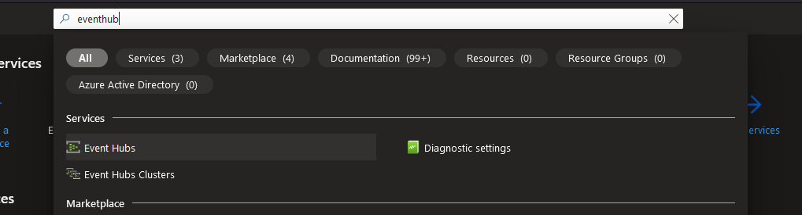
*Navigating to Event Hubs via the Azure Portal.*

The first entry will be the Event Hubs service. Select it to open the Event Hub page. Now select the **+ Create** button near the top left corner (below *Event Hubs*).

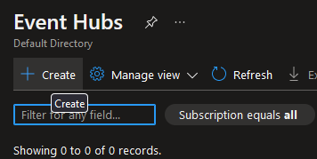
*Select the **Create** button to create a new Event Hub Namespace.*

Here you can select the **Subscription** and **Resource Group** to place the Event Hub in, as well as enter the name of the namespace and its location and pricing tier (I chose *Basic* since this is just a demo). [**Throughput units**](https://learn.microsoft.com/en-us/azure/event-hubs/event-hubs-scalability) dictates how many events can be ingested/sent (1 throughput unit = 1MB/second or 1000 events/second).

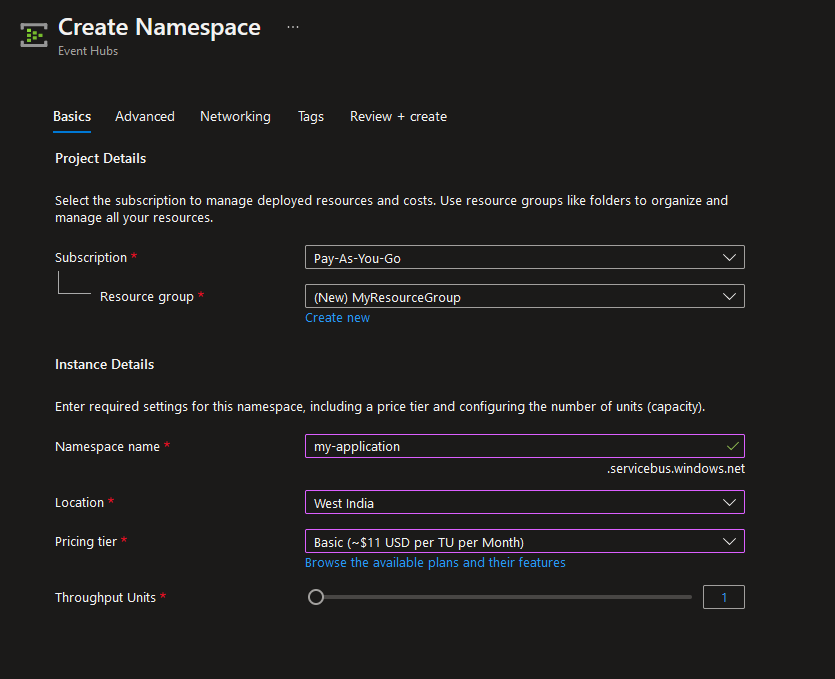
*Configuration before creating a new namespace.*

You can keep the rest of the settings as is and go ahead and create the **Event Hub Namespace** after the review screen appears. It’ll take a few seconds for the namespace to actually be active but once that's done you should be redirected to the newly created namespace.

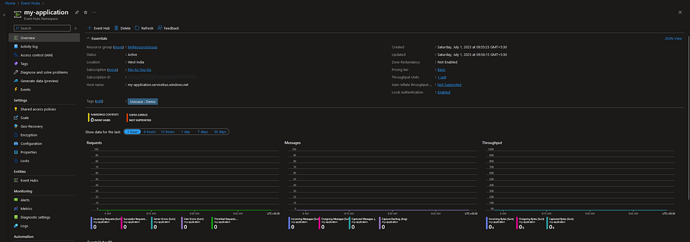
*Event Hub Namespace overview dashboard.*

You’ll see a lot of stuff you can do here as well as see the total requests and messages arriving visualized as well. Now that our namespace is ready, lets actually add our Event Hub in it. Click the **+ Event Hub** button you see near the top left corner.

### Creating the Event Hub

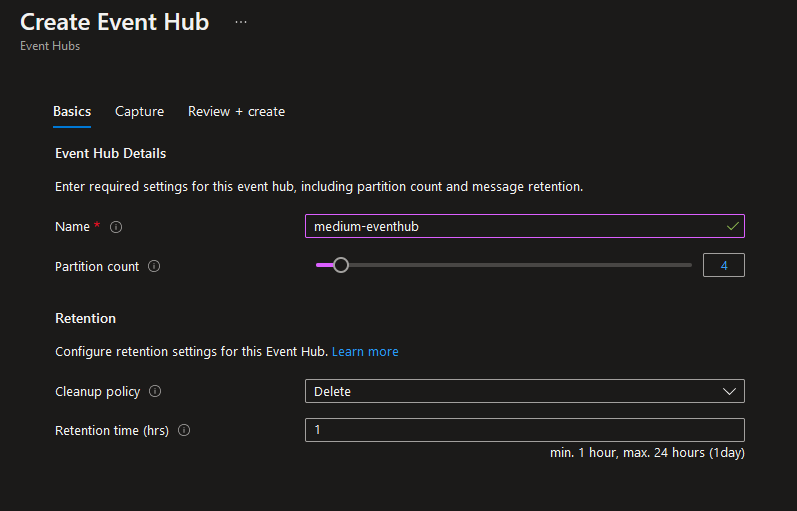
*Configuration before creating a new Event Hub Instance.*

Here we can set the name of the Event Hub as well as its partition and retention counts. **Partitions** are essentially logical splits of the Event Hub. Partitions are useful for parallelizing workloads thus improving throughput and performance. When an event arrives in Event Hub, its placed at the end of a partition. In this way an order is maintained which is useful in cases where the order of events may matter for certain consumer applications. **Retention** dictates how long to keep the event in the Event Hub before disposing it if no consumer acts on it. Again we can keep the defaults for all these and go ahead and create our Event Hub.

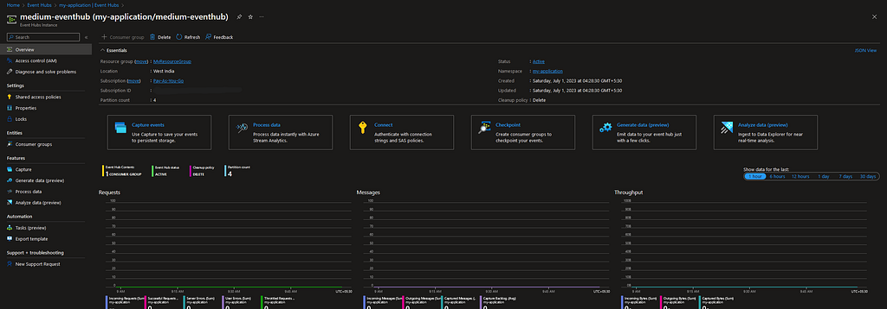
*Event Hub Instance overview dashboard.*

With our Event Hub now created, we can now create consumer groups inside them as well. **Consumer groups** are used to allow multiple applications to read the same event. When an event arrives in a partition, it is replicated for every consumer group. In this demo since we used the *Basic* tier for Event Hubs we are only allowed **one** consumer group, which is already provided with the name `$Default`.

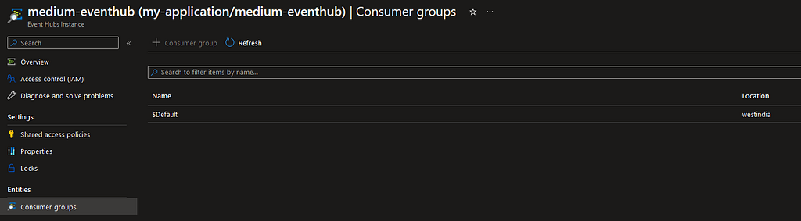
*Consumer groups for your Event Hub Instance.*

To keep track of when or whether an event was consumed or not, **checkpointing** is used. When a consumer successfully reads and process an event, it creates a checkpoint. This checkpoint informs other consumers in the consumer group that the event has been read and to stop processing it. Of course, to allow other consumers to know this, the checkpoint information has to be stored somewhere. For this we will be using **Azure Blob Storage**.

> *Checkpointing is the responsibility of the customer, Azure does not provide it. In our case we’ll be using Spring Cloud Stream which luckily has this checkpointing functionality built in.*

## Creating a Storage Account

Use the search bar at the top of the Azure Portal and search for `storage` account. Click the first entry and it will bring you to the Storage accounts page. Click the **+ Create** button to create a new Storage account.

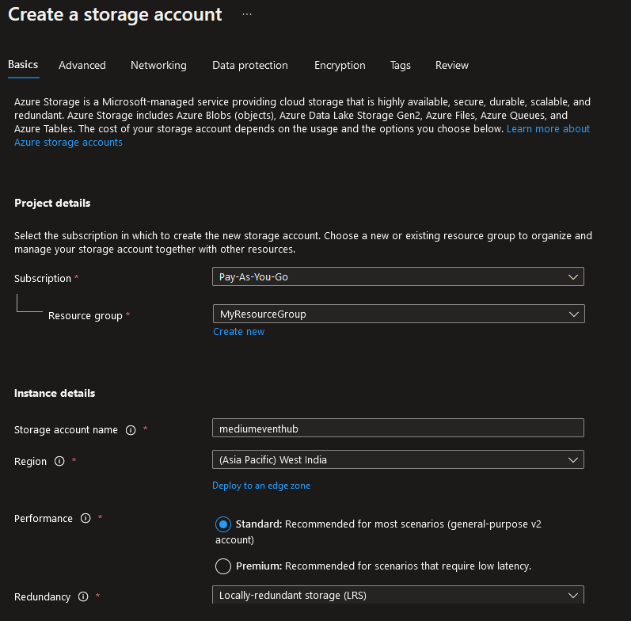
*Configuration before creating a new Storage Account.*

Most of the settings can configured similar to what we did for Event Hubs. Do note that I chose *LRS* for redundancy since this is a demo application. Choose whatever is more applicable to you. We keep the other settings at their default though I suggest you to understand the security configurations to ensure they are accurate to what you want to do.

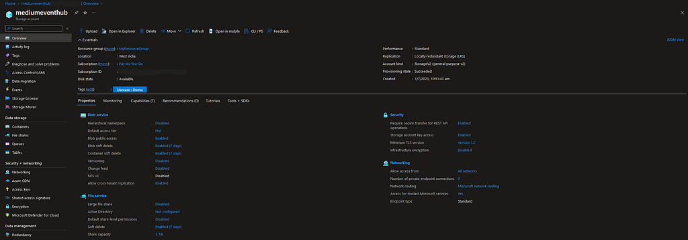
*Storage Account overview dashboard.*

### Creating a container

With our Storage account now created, head to the container tab (click the *Containers* option on the left hand menu) and click the **+ Container** button.

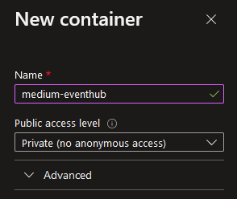
*Configuration for adding a new container.*

This is pretty simple. We aren’t planning to expose this anywhere so set the **Public access level** as *Private* so no applications can look into this container without access. With that done we have now successfully configured a basic Event Hub setup in Azure! Now we can move on to actually using it in our Spring application.

## Implementing Azure Event Hubs with Spring Cloud Stream

This practical assumes you have a bare-bones Spring Web (or WebFlux) application ready. If you haven’t already, use [**Spring Initializr**](https://start.spring.io/) to create your own Spring Application! For dependencies I recommend adding Lombok as well to reduce some boilerplate code.

### Importing Azure Spring Cloud Stream Binder for Event Hubs

As mentioned in the beginning, Azure has developed a library to integrate Event Hubs with Spring Cloud Stream. Using *Gradle*, we can add this library in our `build.gradle` using the following code:

```groovy
implementation 'com.azure.spring:spring-cloud-azure-stream-binder-eventhubs'
```

Also its recommended to ensure your Spring Boot version **matches** with the appropriate Azure dependencies (refer the table [here](https://github.com/Azure/azure-sdk-for-java/wiki/Spring-Versions-Mapping)). We can ensure this using a `mavenBom` as follows:

```groovy
dependencyManagement {
 imports {
  mavenBom 'org.springframework.cloud:spring-cloud-dependencies:2021.0.5'
  mavenBom 'com.azure.spring:spring-cloud-azure-dependencies:4.7.0'
 }
}
```

In my case since my Spring application uses Spring Boot **2.7.12**, the appropriate Spring Cloud version is **2021.0.x** and for Spring Cloud Azure its **4.0.0~4.9.0**.

### Implementing the Consumer

Lets create a new class `EventConsumer` and add a new method `consume` to consume the messages from our Event Hub.

```java
@Slf4j
@Configuration
public class EventConsumer {

    @Bean
    public Consumer<String> consume() {
        return message -> {
            log.info("Message received : {}", message);
        };
    }

    @ServiceActivator(inputChannel = "medium-eventhub.$Default.errors")
    public void consumerError(Message<?> message) {
        log.error("Handling consumer ERROR: " + message);
    }
}
```

We use the `java.util.function.Consumer` interface and register it as a `@Bean` so that we can let Spring Cloud handle configuring it later. We also add a `consumerError` method to log and handle any exceptions that may occur during processing. `@ServiceActivator` is used to indicate that any message routed to the given channel is handled by this method. For consumer channels the `inputChannel` is given by the format `<destination>.<group>.errors` .

### Implementing the Publisher

Similar to the consumer, lets create a new class `EventPublisher` and add a new method in it called `publishMessage` which will allow us to publish our messages to our Event Hub.

```java
@Slf4j
@RequiredArgsConstructor
@Component
public class EventPublisher {

    private final StreamBridge streamBridge;

    public void publishEvent(String message) {
        log.info("Sending message: {}", message);
        streamBridge.send("supply-out-0", message);
        log.info("Sent {}.", message);
    }

    @ServiceActivator(inputChannel = "medium-eventhub.errors")
    public void producerError(Message<?> message) {
        log.error("Handling Producer ERROR: " + message);
    }
}
```

This seems different doesn’t it? Why aren’t we using `java.util.function.Supplier` here? Well as [per the Spring Cloud Stream team](https://docs.spring.io/spring-cloud-stream/docs/current/reference/html/spring-cloud-stream.html#_suppliers_sources), `Supplier` is used when our application acts as the source of data. In that case events would be sent at intervals of time by use of a `poller`. However, there are cases where you would only want to send an event when you want to, like when you call a `POST` Endpoint. For such cases, its recommended to use `StreamBridge` instead (see [here](https://docs.spring.io/spring-cloud-stream/docs/3.2.1/reference/html/spring-cloud-stream.html#_sending_arbitrary_data_to_an_output_e_g_foreign_event_driven_sources)). Using `StreamBridge` is as simple as calling `streamBridge.send("<output-binding>-out-0", your_message)` . The `output-binding` name will be configured later. Spring Cloud Stream will handle the whole effort of sending the event to Event Hub and ensuring it successfully reaches there. We also add a method `producerError` which is similar to the one we added for the consumer. The only difference is we don’t have to provide `group` in the `inputChannel` name.

### Calling the Publisher

For demo purposes, we’ll implement a simple `POST` call to publish a `String` message. Since I am using Spring WebFlux, I implement my controller using `Mono` and reactive chains.

```java
@RestController
@RequiredArgsConstructor
@Slf4j
public class EventhubsController {

    private final EventhubsService eventhubsService;

    private final EventPublisher eventPublisher;

    @PostMapping("/publishMessage")
    public Mono<ResponseEntity<String>> publishMessage() {
        return eventhubsService.someMethod()
                .publishOn(Schedulers.boundedElastic())
                .doOnSuccess(eventPublisher::publishEvent)
                .map(ResponseEntity::ok);
    }

}
```

In the code above, we publish the event as a **side effect** when the method `someMethod` returns a value from the `Service` class as given below.

```java
@Service
@Slf4j
@RequiredArgsConstructor
public class EventhubsService {

    public Mono<String> someMethod() {
        return Mono.just("Some string data");
    }
}
```

> *You might have observed a piece of code in the `Controller` class called `publishOn(Schedulers.boundedElastic())` . This needs to be implemented because in the current library version of `com.azure.spring:spring-cloud-azure-stream-binder-eventhubs:4.7.0` there is a **bug** that prevents `StreamBridge` from being called in **a non-blocking context**. Publishing the reactive chain into a `boundedElastic` thread schedule allows us to call the `StreamBridge` successfully (I have raised an [issue](https://github.com/Azure/azure-sdk-for-java/issues/35215) on this with the Azure team, so it should be resolved in later versions).*  
> **UPDATE**: This issue has been resolved in version **4.20.0** of the library, so you can now update to that version and remove the `publishOn` line!

### Configuring the Properties

We now have our code ready, but we still need to configure it so that it connects to our Event Hub correctly. Below is the properties I have set up for my application in `application.yaml`.

```yaml
spring:
  cloud:
    azure:
      eventhubs:
        connection-string: ${AZURE_EVENTHUB_NAMESPACE_CONNECTION_STRING}
        namespace: my-application
        processor:
          checkpoint-store:
            container-name: medium-eventhub
            account-name: mediumeventhub
            account-key: ${AZURE_STORAGE_ACCOUNT_KEY}
    function:
      definition: consume
    stream:
      output-bindings: supply
      bindings:
        consume-in-0:
          destination: medium-eventhub
          group: $Default
        supply-out-0:
          destination: medium-eventhub
      eventhubs:
        bindings:
          consume-in-0:
            consumer:
              checkpoint:
                mode: RECORD
          supply-out-0:
            producer:
              sync: true
      default:
        producer:
          errorChannelEnabled: true
```

> *For more information on the configuration properties, please refer to the [Spring](https://docs.spring.io/spring-cloud-stream/docs/current/reference/html/spring-cloud-stream.html#_configuration_options) and [Azure](https://learn.microsoft.com/en-us/azure/developer/java/spring-framework/spring-cloud-stream-support?tabs=SpringCloudAzure4x#configuration) documentations.*

Most properties are self explanatory. `spring.cloud.function.definition` is used to define the beans that Spring will register for directing events to for consumption. `spring.cloud.stream.output-bindings` is an optional property that will establish the binding connection for the producer when the application starts instead of the first time `streamBridge.send` is called.

The format for the binding names is `<functionName>-<in/out>-<index>` . `in` is used for consumers and `out` for producers. `index` is used when there are multiple input/output events to receive/send, so for most cases will be 0. For consumers we also have to mention the consumer group alongside the destination (`$Default` in our case). In case of producers because we are using `StreamBridge` we don’t have to define any beans but still we’ll need to assign a binding name so that we can use it when actually sending data.

We set the `consumer.checkpoint.mode` to `RECORD` which checkpoints an event when it successfully goes through the handler method without any thrown exceptions. We also enable `producer.sync` to `true` so that we ensure our events actually reach the Event Hub.

### Configuring Authentication for Event Hubs

There are two properties that aren’t defined in the above config. `${AZURE_EVENTHUB_NAMESPACE_CONNECTION_STRING}` and `${AZURE_STORAGE_ACCOUNT_KEY}`. These are keys that are will be used to allow our application to connect to the Event Hub and Storage Account we setup previously.

> *By default connection string can be used to provide authentication. However its **recommended** to use [service principals (via Azure AD)](https://learn.microsoft.com/en-us/azure/developer/java/spring-framework/authentication#authentication-and-authorization-with-azure-active-directory) and [managed identities](https://learn.microsoft.com/en-us/azure/developer/java/spring-framework/authentication#managed-identities) as credentials instead in real world applications. (I’ll probably make a follow up post on the different authentication methods later on.)*

To get the connection string, navigate to your **Event Hub Namespace**, select *Shared access policies* under *Settings* on the left, and select the **RootManageSharedAccessKey** policy.

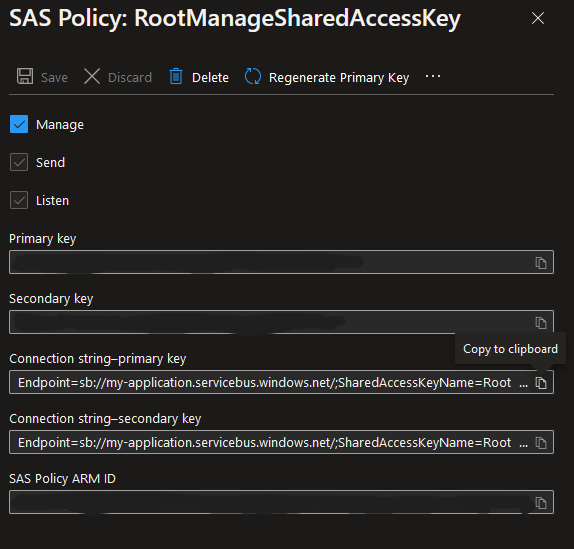
*Authentication properties for SAS Policy.*

Use the value under **Connection string-primary key**.

For the storage account key, navigate to your **Storage Account** and select *Access keys* under *Settings + Networking*.

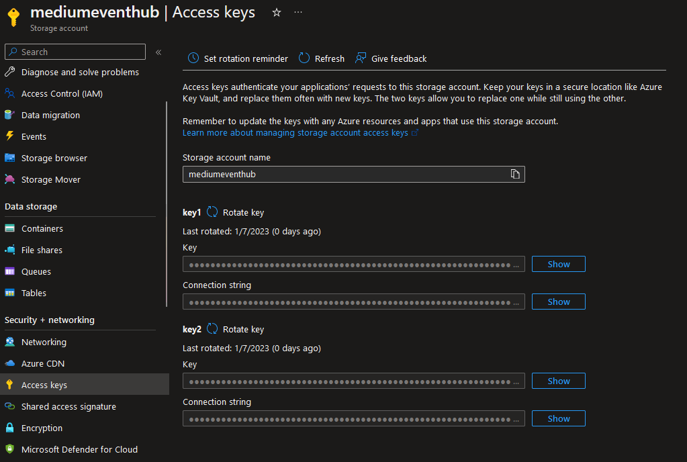
*Access key properties for Storage Account.*

Click on the **Show** button and use the value under **key1**.

## Testing our Application

Now we have successfully configured our Event Hub as well as our application. Now simply run your application in your terminal/IDE and hit the endpoint `POST http://localhost:8080/publishMessage` via Postman or a browser. You should see something like this in the terminal:

```text
[oundedElastic-9] c.s.eventhubs.binder.EventPublisher      : Sending message: Some string data
[oundedElastic-9] c.s.eventhubs.binder.EventPublisher      : Sent Some string data.
[tition-pump-1-6] c.sample.eventhubs.binder.EventConsumer  : Message received : Some string data
```

Hitting the endpoint caused our application to send an event to the Event Hub. The same event then gets consumed by our application since they are connected to the same Event Hub. The logs prove that we have successfully configured our application to communicate using Event Hubs!

## What Next?

You can now try developing another application and having the two communicate with each other via Event Hubs. You can also try configuring multiple consumers and producers in your application, though there is a bit of setup involved (especially for consumers). I’ll probably make a follow up on multi-binder configurations and authentication methods. I hope you enjoyed this article and hopefully can now easily leverage event-driven architectures in your own applications!

## References

- [Produce/Consume Events with Spring Cloud Stream and Event Hub — Aviad Pines](https://medium.com/@aviadpines/produce-consume-events-with-spring-cloud-stream-and-event-hub-4b41fdc1a9f6)
- [Sending and Receiving Message by Azure Event Hubs and Spring Cloud Stream Binder Eventhubs in Spring Boot Application — Azure Spring Boot Samples](https://github.com/Azure-Samples/azure-spring-boot-samples/tree/main/eventhubs/spring-cloud-azure-stream-binder-eventhubs/eventhubs-binder)
- [Spring Cloud Stream Documentation](https://docs.spring.io/spring-cloud-stream/docs/current/reference/html/)
- [Spring Cloud Stream with Azure Event Hubs — Azure Developer Guide](https://learn.microsoft.com/en-us/azure/developer/java/spring-framework/configure-spring-cloud-stream-binder-java-app-azure-event-hub)
- [Features and terminology in Azure Event Hubs — Azure Developer Guide](https://learn.microsoft.com/en-us/azure/event-hubs/event-hubs-features)
