> Originally published on [Medium](https://medium.com/@itsmariodias/understanding-transformers-for-students-71a1cb362218).

*Photo by [Jéan Béller](https://unsplash.com/@chinatravelchannel) on [Unsplash](https://unsplash.com/)*

A few months ago I was invited to give a presentation on the inner workings of Transformers to students from my alma mater. It’s amazing to see how with the advent of ChatGPT the world of Transformers has exploded into the public space. Having learnt these concepts back when I was a student myself, I was glad to share my knowledge with others and I decided it might be a good idea to share it with other students around the world as well. Without further ado, lets begin!

## A brief history

A bit of a history lesson before we dive into the topic at hand. Before Transformers, Natural Language Processing tasks and applications usually used recurrent neural networks, or RNNs for short. RNNs consumed data in a sequential order, relying on hidden states to store some information that it would use for analyzing further input in the same sequence. The problem with this approach was that it limited their growth and accuracy with longer sequences of data, so context was easily lost for larger paragraphs of text. This step by step analysis also affected training time, since the sequential order meant that the model training and inference time scaled linearly with the input sequence length. Attention was initially introduced with the aim to combat this short term memory loss problem, forcing the networks to only attend to key features in the input and output sequences.

## Enter Transformers

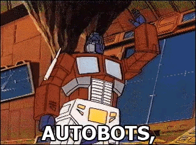
*Autobots, Roll Out!*

In 2017, Vaswani et al. in a paper titled Attention Is All You Need introduced the concept of Transformers, a model architecture that relied entirely on the attention mechanism. By eliminating the need for RNNs, the model allowed for more parallelization during training, thus allowing it to reach state of the art results in a comparatively shorter amount of time compared to older RNNs. One of the key features introduced in this model was the concept of self-attention to model the representation of input sequences of data, which I’ll explain shortly.

## Model Architecture

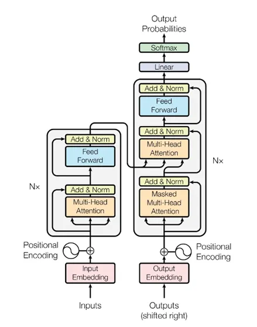
*Model architecture for Transformers ([Attention Is All You Need](https://arxiv.org/abs/1706.03762))*

The above diagram gives you an overview as the what composes the Transformer. They are based on the encoder-decoder architecture, with the left block representing the encoder and the right block the decoder. The encoder ‘encodes’ the input sequence into a sequence of ‘continuous representation’ that is then fed mid-way to the decoder which then ‘decodes’ the output sequence using both the output from the encoder as well as the intermediate output from the previous output generated by the decoder (or during training, the target output itself).

> *This generative cycle of the decoder is why models that use this architecture are called Generative Models. However do note its not mandatory to use these models in this way, you could just run the decoder once, but you would still need to feed some data to the decoder as well.*

Lets now dive into each of the modules to understand them in detail.

## Embedding and Positional Encoding

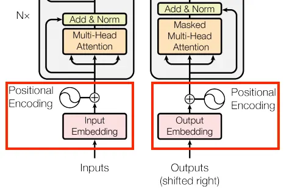
*Input/ Output Embedding and Positional Encoding layers ([Attention Is All You Need](https://arxiv.org/abs/1706.03762))*

### Embedding

Before we can actually starting training our model, we need to convert our sequences of text into a format that the model can understand. In this case that format is numbers, so we need to associate each word/token in our sentence with a unique number, and we need to do this for each sentence in our entire input dataset. Once this is done, we then convert each word /token into a vector representation which represent the **Embedding layer**. Previously, we used fixed embeddings like GloVe to represent each word, however this wasn’t useful since the context in which the word is being used also matters, and so we instead use learned embeddings that will adjust the vectors during training. The embeddings computed are multiplied by √d where d is the dimension of the embedding (This dimension is a hyperparameter that can be adjusted during training)

### Positional Encoding

Because Transformers do not use RNNs, there is no sequential order for the model to make use of during computation, which when it comes to text is important in understanding how context travels. So instead we add a new set of encodings called **positional encodings** that represent the position of a token/word relative to the others in a given sequence of text. The formula the authors used to compute this is:

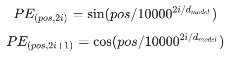
*sine and cosine functions for computing the positional encodings.*

I won’t go over this much, but basically the 2 functions above represent the position for even and odd position tokens and are interleaved together to get the overall positional encoding. The authors used this because they hypothesized that it would allow the model to easily learn to attend by relative positions due to the linear properties of the above functions.

> *If you would like to understand this better, [this tutorial](https://www.tensorflow.org/text/tutorials/transformer#the_embedding_and_positional_encoding_layer) has a better visual representation of the above equations.*

## Attention

:::pullquote
An attention function can be described as mapping a query and a set of key-value pairs to an output, where the query, keys, values, and output are all vectors. The output is computed as a weighted sum of the values, where the weight assigned to each value is computed by a compatibility function of the query with the corresponding key. (Section 3.2, [Attention Is All You Need](https://arxiv.org/abs/1706.03762))
:::

If that sounds confusing, just remember that:

> *The **query** is what you’re trying to find.*
>
> *The **key** is what sort of information the dictionary has.*
>
> *The **value** is that information.*
>
> *Source — ([TensorFlow Transformer Tutorial](https://www.tensorflow.org/text/tutorials/transformer#the_base_attention_layer))*

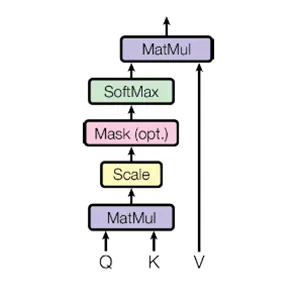
*Scaled Dot-Product Attention ([Attention Is All You Need](https://arxiv.org/abs/1706.03762))*

Transformers introduced an attention mechanism called Scaled Dot-Product Attention. The equation for it given by:

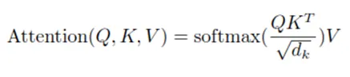
*Equation for Scaled Dot-Product Attention*

Where Q, K, V represent the query, key and value vectors. In most applications of Transformers, K and V are the same vector with Q being the input for which you require some answer. We compute the dot product of Q and K and divide it by √d where d is the dimension of the attention layer. We then take the softmax of this output, which is basically converting the output into probability scores which we then multiply with the value vector. This attention mechanism allows us to focus on the relevant parts of the value vector so they can be used in later computations.

## Multi-Head Attention

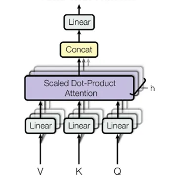
*Multi-Head Attention ([Attention Is All You Need](https://arxiv.org/abs/1706.03762))*

Rather than perform a single attention, which would be expensive for larger dimensions of key, value and query, we instead perform linear projection on Q, K and V to convert them into smaller dimensions and then perform the above attention. We do this multiple times in separate instances or ‘heads’ with the goal to allow the model to jointly attend to information from different representations as each head would likely attend to different spaces for the same Q, K and V pair. The output from each attention head is then concatenated and linear projected to get an aggregated output.

## Feed Forward Networks

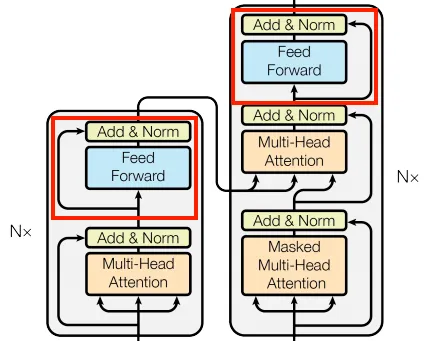
*Feed Forward Network ([Attention Is All You Need](https://arxiv.org/abs/1706.03762))*

At the end of an encoder/decoder block, we apply a feed forward layer. This is basically a multi-layer perceptron, with a ReLU (rectified linear unit) activation function (basically removes negative numbers from the vector setting them to zero instead) in-between the 2 fully connected layers and a dropout layer at the end. The inner fully connected layer has a dimensionality that is typically 4 times greater than the input / output dimension. The equation for this network is given as:

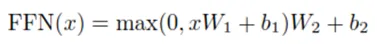
*Equation for Feed Forward Networks*

Where the fully connected layer is represented as `F(x) = xW + b` where W is the weight and b is the bias. ReLU is represented as `ReLU(x) = max(0, x)`.

## Residual Connections and Normalization

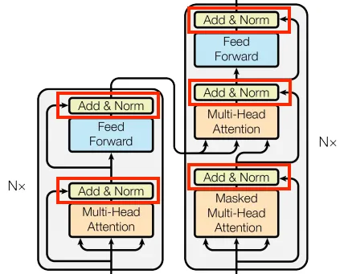
*Residual Connections and Normalization ([Attention Is All You Need](https://arxiv.org/abs/1706.03762))*

After each attention and feed forward block we add the input vector to the output vector (this is called a **residual connection**) and then we perform **layer normalization** on the sum. This is usually done to improve training performance and stability.

## The Encoder Layer

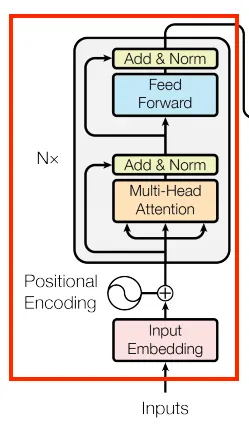
*The Encoder Layer ([Attention Is All You Need](https://arxiv.org/abs/1706.03762))*

Now that we have seen each block, its time to see how they come together. The input embeddings we supply are computed by **a set of N encoder blocks**. Each encoder block consists of a multi-head attention layer where we perform **self-attention** on the input, i.e. where Q, K and V are the same vector. The output of this is then supplied to the feed forward layer whose output is then consumed by the next encoder block as its input. The Nth encoder block’s output is then used as the K, V pair for the cross-attention layer in the decoder blocks. The input embeddings and the N encoder blocks compose the encoder layer.

### Self-Attention

When we supply the same input vector as the query, key and value to the Multi-Head Attention block, this is known as **Self-Attention**. Self-Attention allows every element in the sequence access to every other element in the sequence in parallel and thus allows the elements to associate themselves with other elements and build stronger representations of context. This was previously done with the help of RNNs and CNNs but they were limited by their sequential nature and range.

## The Decoder Layer

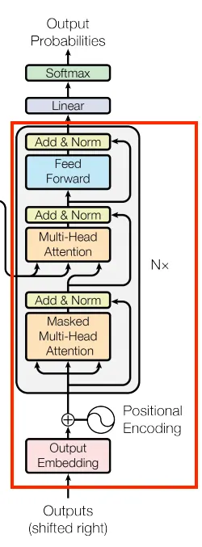
*The Decoder Layer ([Attention Is All You Need](https://arxiv.org/abs/1706.03762))*

The Decoder layer is a bit more interesting. Most of the structure is pretty much the same, with **N number of decoder blocks** taking the output embeddings as input and then its output being used by the next block until eventually the final output is sent to the **classification layer**. You might notice that there are two Multi-Head Attention blocks here though, the first one adds a twist to the usual self-attention block called **masked self-attention**. The output of this is then used as the query vector in the next multi-attention block called the cross-attention block where the key and value pair is given by the final output of the encoder layer. This is where the model actually learns to map the output so that it is aligned with what the input represents. The final output after passing through all the decoder blocks is then linear projected to a vector upon which we apply softmax to get the output probabilities which can then be used to predict the most likely token that should be generated.

> *The final linear and softmax layers can be replaced with any classification ‘head’ based on the task you want to train your model for.*

### Masked Self-Attention

The twist in the self-attention used by the decoder is that K and V are masked so that for a given sequence the element in the Q vector can only attend to its previous elements. This is useful to teach the model during training that it cannot rely on information further in the sequence, which it would be able to access when the model is being trained, but not when its being used during inference. As a consequence, during training we **shift the output sequence right** once (by adding a `<START>` token), so that a token can only attend to its previous tokens (shifting right prevents a given token from attending to itself hence making the entire decoder causal in nature).

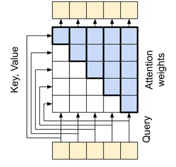
*Masking in the Self-Attention Block of the Decoder ([Source](https://www.tensorflow.org/text/tutorials/transformer#the_causal_self_attention_layer))*

## Training the Transformer

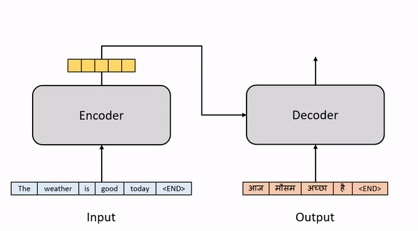
*Visualization of output generation during training. (Image by Author)*

Now that we have discussed how the Transformer works, lets understand how you would go about training it. For example purposes, lets assume we are using the Transformer for a machine translation task i.e. English to Hindi translation. For this we supply English sentences as input and their corresponding Hindi translations as the output. During training we supply both the input and output to the model to train with. The outputs supplied to the decoder are shifted right (as mentioned previously) to ensure that the model only generates the current word using all the English words and the Spanish words that occur before it. The model outputs word probabilities i.e. predicts the most likely word for each step. During a training iteration for a given sentence pair we only need to run the model once since we already have the output generated and so we can supply the entire sentence and predict the same sentence in the same step. For machine translation, we evaluate our model based on how similar the generated translation is to the given target translation using a metric called the BLEU score.

## During Inference

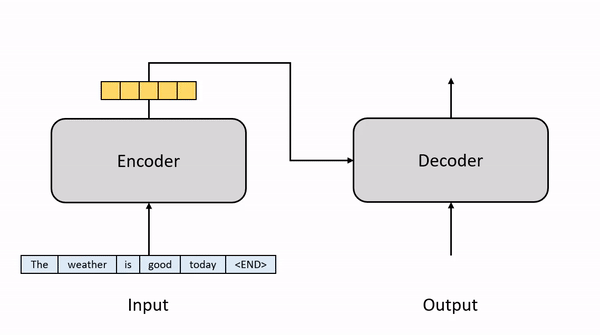
*Visualization of output generation during inference. (Image by Author)*

After training our model for a while, now we can use it for actual translation tasks. As discussed previously, during inference the model wouldn’t have access to the output before generating the translation. So what do we feed the decoder? Here we instead go through an **iterative process** (autoregressive). At first we supply the decoder with a `<START>` token to indicate the beginning of the sentence. With that and the output from the encoder, we iteratively run the decoder, taking the last generated token from the output, appending it to the output sentence and supplying it back to the decoder. We can adjust the decoder so it only generates the next token, which we add to the end of the final output sentence (since we already have the previous tokens). This process continues iteratively until an `<END>` token is obtained (or we reach the maximum number of tokens that can be generated) which indicates the end of the sentence, at which point we have obtained our translated sentence.

> *During training, we could have followed the same method used during inference and generate the next token based on the previously predicted tokens and only use the target sentence for evaluating the final output. But this decreases training performance, as the model would end up relying on a potential erroneously generated token to generate the next token. By supplying the actual correct token to the decoder, the model can use it to try to correctly predict what the next token should be rather than relying on its own wrong predictions. This is known as **Teacher Forcing**.*

## Applications

Now that we have successfully seen how Transformer can be used for machine translation tasks, what else can it be used for? At the time of writing, it seems with GPT-4 that answer could be everything. But here is a short list of the obvious ones:

- Language Modelling
- Machine Translation
- Sentiment Analysis
- Classification
- Next-Sentence Prediction
- Paraphrasing
- Question Answering

## Examples

There are numerous examples of models based on Transformers being successfully used in the real-world. The 2 most famous examples are BERT (Bidirectional Encoder Representations from Transformers) and GPT (Generative Pretraining Transformer). Both follow the same architecture but with some alterations.

## Final Thoughts

Thanks for making it all the way through to the end of this article. Its my first time writing one and I am open to feedback or any suggestions for improvement. Hopefully I have at least made Transformers a bit simpler for you to understand, with which you can probably go ahead and try to read the actual paper and gain even more clarity. There are also great articles here on Medium on the same topic which I’ll reference below. I’ll try to follow up on this post with a practical tutorial on how you can leverage pre-trained transformers (like BERT) in your own models and tasks. Stay tuned for more!

## References

- [Transformers Explained Visually — Ketan Doshi](https://towardsdatascience.com/transformers-explained-visually-part-1-overview-of-functionality-95a6dd460452)
- [Illustrated Guide to Transformers — Michael Phi](https://towardsdatascience.com/illustrated-guide-to-transformers-step-by-step-explanation-f74876522bc0)
- [Training the Transformer Model — Machine Learning Mastery](https://machinelearningmastery.com/training-the-transformer-model/)
- [Attention Is All You Need — Ashish Vaswani, Noam Shazeer, Niki Parmar, et al.](https://arxiv.org/abs/1706.03762)
- [Transformer Tutorial - TensorFlow](https://www.tensorflow.org/text/tutorials/transformer)
- [Transformer Tutorial - PyTorch](https://nlp.seas.harvard.edu/annotated-transformer/)
